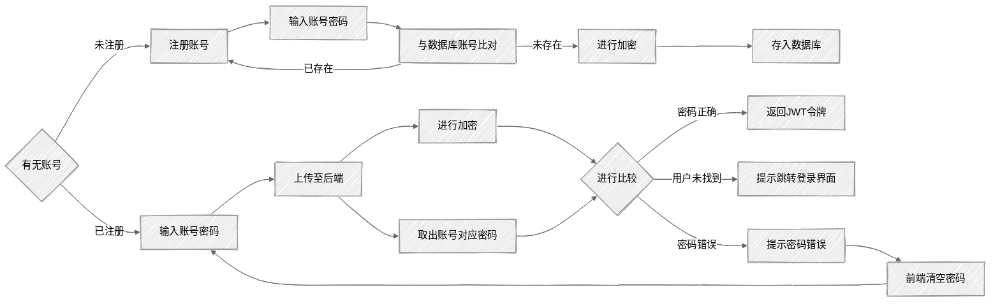

# 系统架构

## 技术栈选择依据
### 1. 客户端技术栈

#### 1.1 Uniapp

- **跨端开发**：
  - Uniapp 支持一套代码多端运行（H5、微信小程序、移动端），大幅降低开发和维护成本。
  - 基于 Vue 语法，学习成本低，开发效率高。
- **生态丰富**：
  - 支持丰富的插件市场，可快速集成第三方功能（如地图、支付、推送等）。
  - 提供原生渲染能力，性能接近原生应用。

#### 1.2 Iconfont

- **图标管理**：
  - Iconfont 提供海量矢量图标，支持按需加载，减少资源体积。
  - 支持多色图标，满足复杂 UI 需求。
- **灵活性**：
  - 通过 CSS 控制图标样式，方便适配不同主题和场景。

#### 1.3 Vuex

- **状态管理**：
  - Vuex 是 Vue 生态中的状态管理库，适合中大型项目。
  - 支持模块化管理，便于维护和扩展。
- **数据共享**：
  - 在多个组件之间共享数据，避免重复请求和状态不一致问题。

#### 1.4 UView UI

- **UI 组件库**：
  - UView 是 Uniapp 生态中的 UI 组件库，提供丰富的组件（如表格、表单、弹窗等）。
  - 支持主题定制，适配多端样式。
- **开发效率**：
  - 提供开箱即用的组件，减少重复开发。

#### 1.5 Vite

- **构建工具**：
  - Vite 是新一代前端构建工具，支持快速冷启动和热更新。
  - 基于原生 ES 模块，提升开发体验。
- **性能优化**：
  - 支持按需加载，减少打包体积，提升页面加载速度。

------

### 2. 服务端技术栈

#### 2.1 Fastapi：

##### 原因：

一、速度快
FastAPI 是基于 Starlette 和 Pydantic 构建的，天然支持异步（async/await）。
单接口性能接近 Node.js 和 Go，远超传统的 Flask、Django。
二、开发效率高
支持自动生成 OpenAPI（Swagger）文档，不用手写接口文档。
请求参数、响应结果都有自动校验，只需简单定义 Pydantic 模型。
几乎写完接口代码，文档、校验、序列化都自动做好了。
三、学习曲线平滑
语法风格清晰，基本接近 Flask。
如果用过 Flask/Django，很快可以上手。
兼容传统同步代码，也支持异步调用，过渡非常友好。
四、生态现代
内置支持 CORS、OAuth2、JWT认证等功能。
能很好地和 SQLAlchemy、Tortoise ORM、Pydantic 等库结合。
与前端（比如uniapp、React、Vue）联调非常舒服，接口标准化好。

##### 主要使用到的库：

- FastAPI：核心框架，用来定义路由和处理HTTP请求。
- SQLAlchemy：ORM框架，操作数据库用的，直接用Python对象管理数据。
- Pydantic：用来做数据模型和请求数据校验。
- Uvicorn：作为ASGI服务器启动FastAPI项目。
- Alembic（可选）：数据库迁移工具，方便后期管理数据表结构变更（目前开发阶段用得少）。
- Pytest：后端接口测试用的框架

#### 2.2 MySQL

- **关系型数据库**：
  - MySQL 是成熟的关系型数据库，适合存储结构化数据。
  - 支持事务处理，确保数据一致性。
- **性能优化**：
  - 通过索引、分库分表等手段优化查询性能。
  - 支持主从复制和读写分离，提升数据库并发能力。

#### 2.3 Redis

- **缓存加速**：
  - Redis 作为内存数据库，适合缓存高频访问数据（如用户信息、配置数据）。
  - 支持多种数据结构（如 String、Hash、List），满足不同业务场景。
- **分布式锁**：
  - 通过 Redis 实现分布式锁，解决并发问题。

#### 2.4 JWT（JSON Web Token）

- **无状态认证**：
  - JWT 是一种无状态的身份验证机制，适合分布式系统。
  - 减少服务端存储压力，提升系统扩展性。
- **安全性**：
  - 结合 MD5 加密和签名算法，确保令牌的安全性。
  - 支持自定义过期时间，提升系统安全性。

------

### 3. 基础设施技术栈

#### 3.1 阿里云 ECS

- **稳定可靠**：
  - 阿里云 ECS 提供稳定的计算资源，支持按需扩容。
  - 提供多种实例类型，满足不同业务需求。
- **成本控制**：
  - 支持按量付费和预留实例，优化成本。

#### 3.2 Docker 容器

- **环境一致性**：
  - Docker 容器化部署，确保开发、测试和生产环境的一致性。
  - 支持快速部署和回滚，提升运维效率。
- **资源隔离**：
  - 容器之间资源隔离，避免相互影响。

#### 3.3 阿里云 OSS

- **对象存储**：
  - 阿里云 OSS 提供高可靠、低成本的对象存储服务。
  - 适合存储静态资源（如图片、视频、文件等）。
- **CDN 加速**：
  - 结合 CDN 加速，提升资源访问速度，降低服务器负载。

#### 3.4 SLS 日志管理

- **集中管理**：
  - 阿里云 SLS 提供集中化的日志管理服务，支持实时查询和分析。
  - 支持多种日志来源（如服务器日志、应用日志）。
- **可视化分析**：
  - 提供丰富的可视化工具，便于问题排查和性能优化。

------

### 4. 技术栈选择的核心理由

#### 4.1 开发效率

- Uniapp 跨端开发和 Spring Boot 的快速开发能力，显著提升开发效率。
- 丰富的插件和开箱即用的功能，减少重复开发。

#### 4.2 性能与扩展性

- Spring Boot 和 Redis 的高性能特性，满足高并发场景。
- MySQL 和 Redis 的扩展能力，支持业务快速增长。

#### 4.3 成本控制

- 阿里云 ECS 和 OSS 提供灵活的计费方式，优化成本。
- Docker 容器化部署，降低运维成本。

#### 4.4 安全性与稳定性

- JWT 和 MD5 加密确保身份验证的安全性。
- 阿里云基础设施提供高可用性和安全性保障。

## 关键架构设计
* 用户登录流程：

* 优化措施：

  1.分页加载：每次加载固定条数数据

  2.懒加载：仅在数据临近时再进行加载

  
