# UI设计

## App地图
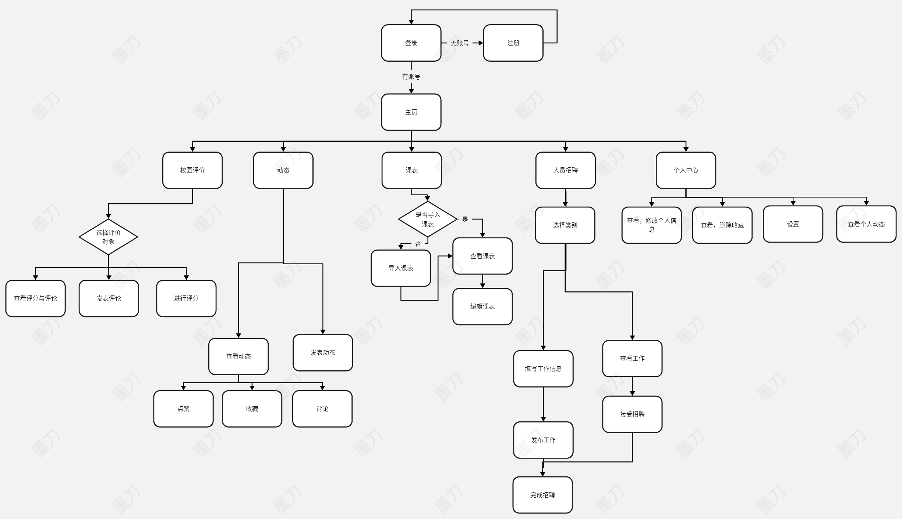

## 线框图
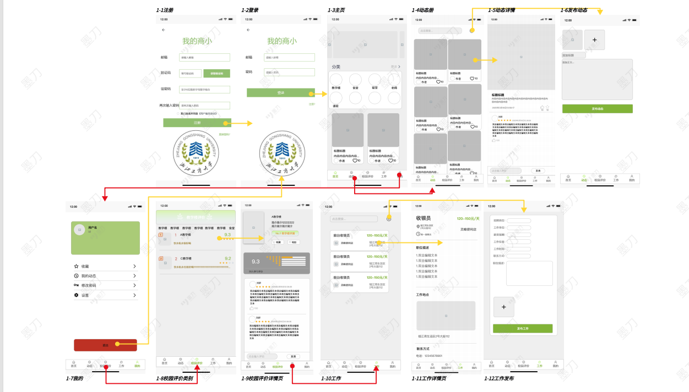

## UI设计
### 主页.png
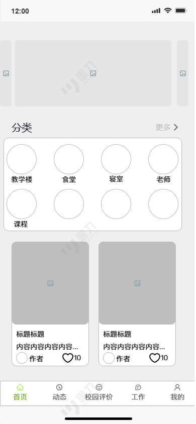

### 动态.png
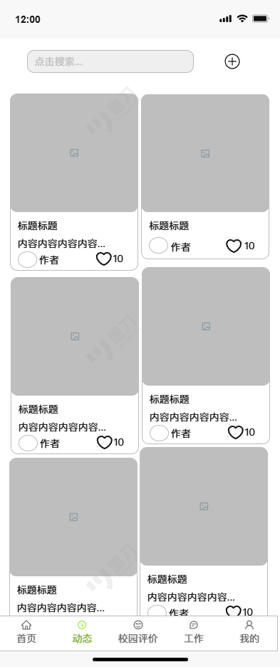

### 动态详情.png
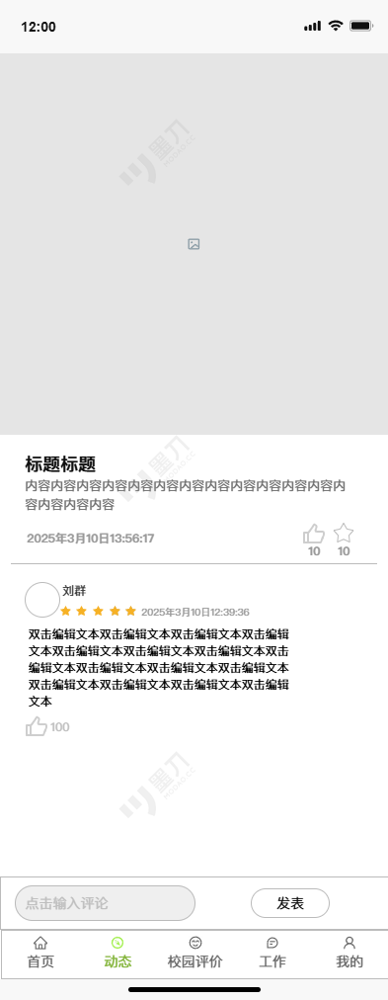

## 发布动态.png

### 工作.png
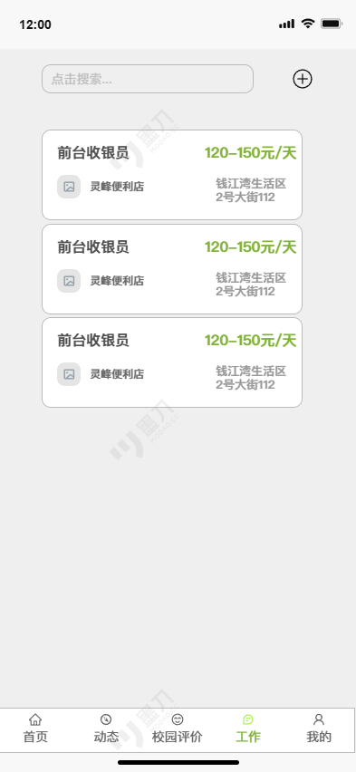

### 工作发布.png
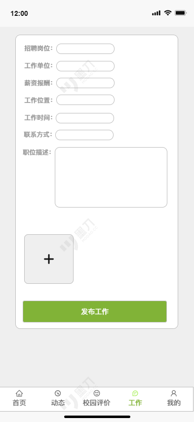

### 工作详情页.png
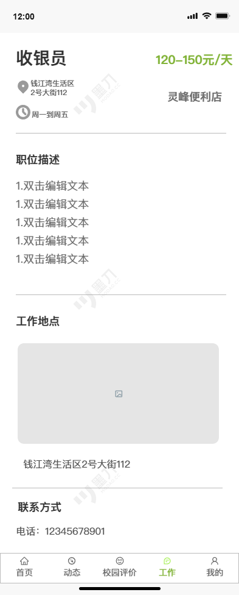

### 我的.png
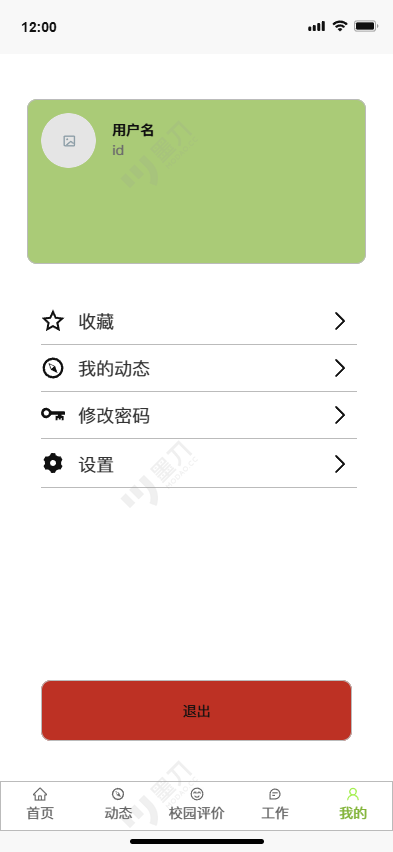

### 校园评价类别.png

### 校园评价详情页.png
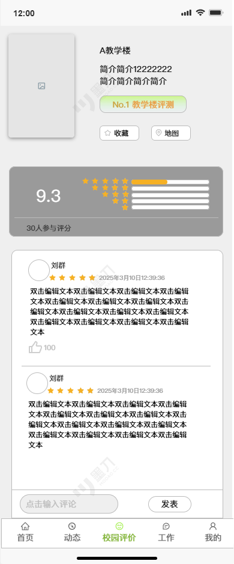

### 注册.png
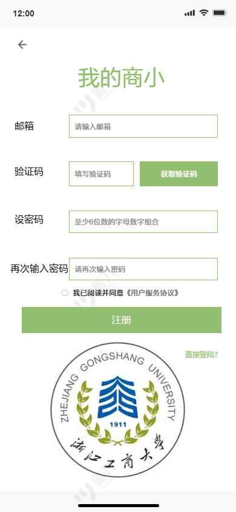

### 登录.png
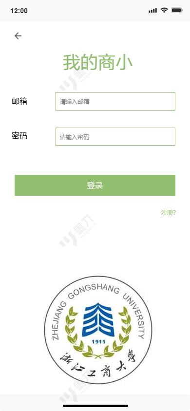

