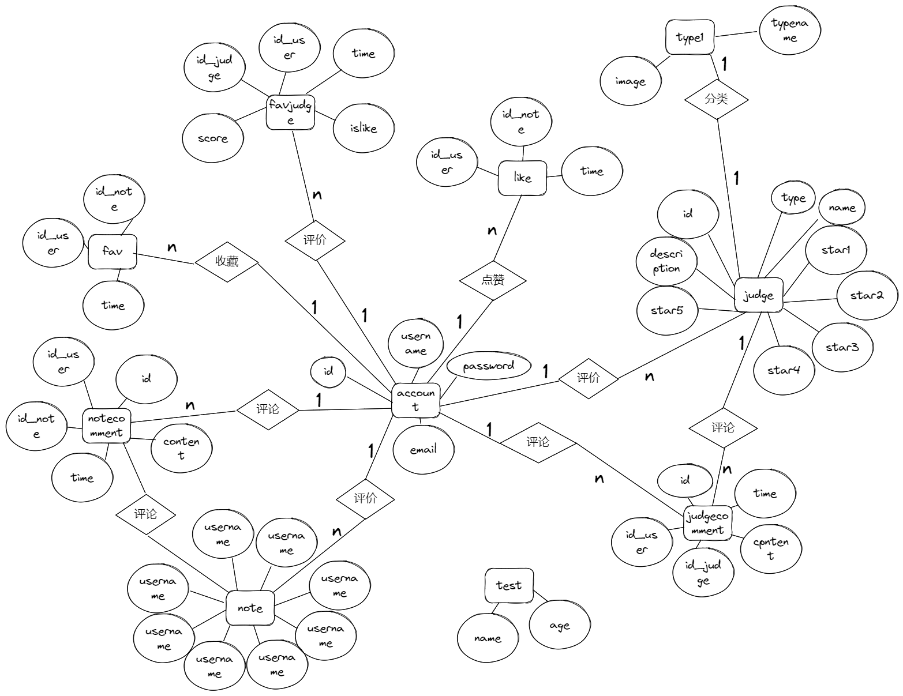

# 期中报告

## 前端

### github地址： https://github.com/Fourffffff/MyShangxiao_frontend

### 开发框架与实现：

#### 1.1 Uniapp

- **跨端开发**：
  - Uniapp 支持一套代码多端运行（H5、微信小程序、移动端），大幅降低开发和维护成本。
  - 基于 Vue 语法，学习成本低，开发效率高。
- **生态丰富**：
  - 支持丰富的插件市场，可快速集成第三方功能（如地图、支付、推送等）。
  - 提供原生渲染能力，性能接近原生应用。

#### 1.2 Iconfont

- **图标管理**：
  - Iconfont 提供海量矢量图标，支持按需加载，减少资源体积。
  - 支持多色图标，满足复杂 UI 需求。
- **灵活性**：
  - 通过 CSS 控制图标样式，方便适配不同主题和场景。

#### 1.3 Vuex

- **状态管理**：
  - Vuex 是 Vue 生态中的状态管理库，适合中大型项目。
  - 支持模块化管理，便于维护和扩展。
- **数据共享**：
  - 在多个组件之间共享数据，避免重复请求和状态不一致问题。

#### 1.4 UView UI

- **UI 组件库**：
  - UView 是 Uniapp 生态中的 UI 组件库，提供丰富的组件（如表格、表单、弹窗等）。
  - 支持主题定制，适配多端样式。
- **开发效率**：
  - 提供开箱即用的组件，减少重复开发。

#### 1.5 Vite

- **构建工具**：
  - Vite 是新一代前端构建工具，支持快速冷启动和热更新。
  - 基于原生 ES 模块，提升开发体验。
- **性能优化**：
  - 支持按需加载，减少打包体积，提升页面加载速度。

------

### 测试方案

#### 测试工具：

单元测试与组件测试

- vitest（vite官方出品，快速轻量）
- jest（成熟稳定，社区庞大）
- vue-test-utils（vue官方测试工具，适配uniapp vue2或vue3版本）

端到端测试（E2E测试）

- uni-app自带的dcloud测试框架（简单项目）
- Cypress（流行、强大）
- Nightwatch.js（传统选择）

性能测试

- Chrome开发者工具（Lighthouse）
- 微信开发者工具自带性能分析
#### 测试流程

安装测试框架

- 安装vitest或jest等依赖
- 安装vue-test-utils

编写测试用例

- 单元测试：测试单个函数逻辑是否正确
- 组件测试：挂载组件，模拟点击、输入，断言DOM变化
- 集成测试：模拟多个组件协作的场景
- E2E测试：模拟用户流程，如登录、提交表单等

运行测试

- 使用命令行执行测试脚本
- 测试通过即绿色，失败会提示错误

生成测试报告

- jest可以自动生成测试覆盖率报告

- E2E测试可以生成流程截图或视频

### 开发进度

完成页面10个，组件5个。目前缺少测试和用户的个人信息编辑的功能。


----

## 后端

### github地址：https://github.com/Fourffffff/python_backend.git

### 技术开发框架和实现文档： 

框架：FastAPI

说明：

一、速度快
FastAPI 是基于 Starlette 和 Pydantic 构建的，天然支持异步（async/await）。
单接口性能接近 Node.js 和 Go，远超传统的 Flask、Django。
二、开发效率高
支持自动生成 OpenAPI（Swagger）文档，不用手写接口文档。
请求参数、响应结果都有自动校验，只需简单定义 Pydantic 模型。
几乎写完接口代码，文档、校验、序列化都自动做好了。
三、学习曲线平滑
语法风格清晰，基本接近 Flask。
如果用过 Flask/Django，很快可以上手。
兼容传统同步代码，也支持异步调用，过渡非常友好。
四、生态现代
内置支持 CORS、OAuth2、JWT认证等功能。
能很好地和 SQLAlchemy、Tortoise ORM、Pydantic 等库结合。
与前端（比如uniapp、React、Vue）联调非常舒服，接口标准化好。

##### 主要使用到的库：

- FastAPI：核心框架，用来定义路由和处理HTTP请求。
- SQLAlchemy：ORM框架，操作数据库用的，直接用Python对象管理数据。
- Pydantic：用来做数据模型和请求数据校验。
- Uvicorn：作为ASGI服务器启动FastAPI项目。
- Alembic（可选）：数据库迁移工具，方便后期管理数据表结构变更（目前开发阶段用得少）。
- Pytest：后端接口测试用的框架

数据库设计文档：

- 数据表：

  

  ```mermaid
  erDiagram
      account {
          int id PK "Primary Key"
          string username
          string email
          string password
      }
  
      note {
          int id PK "Primary Key"
          int author_id FK "Foreign Key to account"
          string title
          string content
          datetime time
          json images
          int likes
          int favs
      }
  
      like {
          int id_user PK "Primary Key, Foreign Key to account"
          int id_note PK "Primary Key, Foreign Key to note"
          datetime time
      }
  
      fav {
          int id_user PK "Primary Key, Foreign Key to account"
          int id_note PK "Primary Key, Foreign Key to note"
          datetime time
      }
  
      notecomment {
          int id PK "Primary Key"
          int id_user FK "Foreign Key to account"
          int id_note FK "Foreign Key to note"
          string content
          datetime time
      }
  
      judge {
          int id PK "Primary Key"
          string name
          string description
          string type FK "Foreign Key to type1"
          int star1
          int star2
          int star3
          int star4
          int star5
      }
  
      judgecomment {
          int id PK "Primary Key"
          int id_user FK "Foreign Key to account"
          int id_judge FK "Foreign Key to judge"
          string content
          datetime time
      }
  
      type1 {
          string typename PK "Primary Key"
          string image
      }
  
      favjudge {
          int id_user PK "Primary Key, Foreign Key to account"
          int id_judge PK "Primary Key, Foreign Key to judge"
          int score
          datetime time
          boolean islike
      }
  
      account ||--o{ note : "writes"
      account ||--o{ like : "likes"
      account ||--o{ fav : "favorites"
      account ||--o{ notecomment : "comments"
      account ||--o{ judgecomment : "comments"
      account ||--o{ favjudge : "favorites judges"
  
      note ||--o{ like : "is liked by"
      note ||--o{ fav : "is favorited by"
      note ||--o{ notecomment : "has comments"
  
      judge ||--o{ judgecomment : "has comments"
      judge ||--o{ favjudge : "is favorited by"
  
      type1 ||--o{ judge : "categorizes"
  
  ```

- ER图：

  

### 测试方案

后端测试方案

一、测试目的
 主要是为了确保后端接口正常工作，数据能够正确存取，功能符合预期，避免上线后出问题。

二、测试框架选择

- 使用的是`pytest`来进行后端接口测试，简单易用，集成方便。
- 搭配`httpx`或者直接用FastAPI自带的`TestClient`进行接口请求测试。
- 数据库操作通过SQLAlchemy完成，所以也要测试数据库相关的逻辑。

三、测试准备

- 搭建一个独立的测试数据库，防止测试污染正式环境的数据。
- 在测试前用脚本（比如`scripts/init_db.py`）初始化好基本数据，比如创建一个测试用户。
- 测试结束后可以清空测试数据库或者重置状态，保证每次测试都是干净的环境。

四、测试内容
 主要测试这几大块：

1. **接口联通性测试**

- 确认接口能正常访问。
- 请求格式正确，返回状态码是200。

1. **功能逻辑测试**

- 比如评论接口：提交一条评论后，要能在评论列表里查询到。
- 登录接口：输入正确账号密码能登录，错误密码返回提示。

1. **异常场景测试**

- 提交不合法参数，看后端能否返回合理的错误信息（比如422 Unprocessable Entity）。
- 登录接口测试未授权、token过期的情况。

1. **数据库数据验证**

- 关键操作后检查数据库，确认数据确实被正确插入、修改或者删除。

五、测试流程

1. 运行`pytest`，启动自动化测试。
2. 每个接口用TestClient模拟HTTP请求。
3. 测试完成后，打印测试结果。失败的用例定位具体错误，修复后重新测试。
4. 保持测试覆盖率，避免遗漏重要逻辑。
### 开发进度

17个接口，配合前端完成了前端目前所需功能。并且大致上每个接口都有对应的一个测试用例。目前还缺少用户信息上传储存，修改的接口。未来将会将一些耦合度过高的接口解耦，将过于复杂的接口拆分，并且为每个接口多添加一些测试用例。

