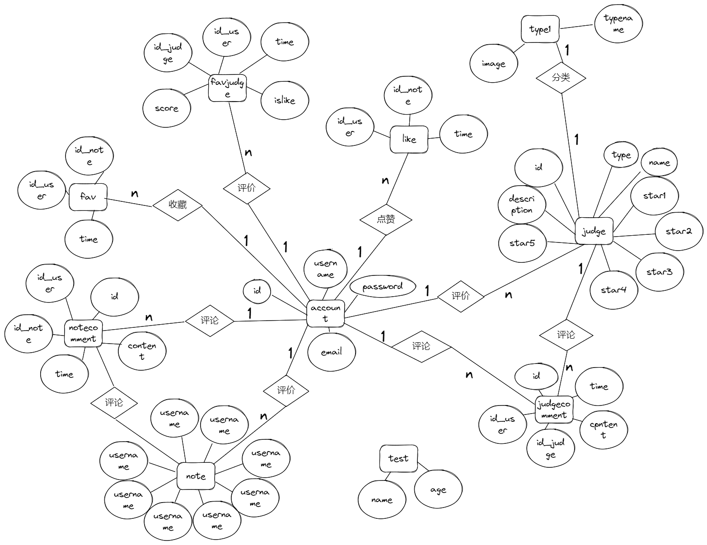
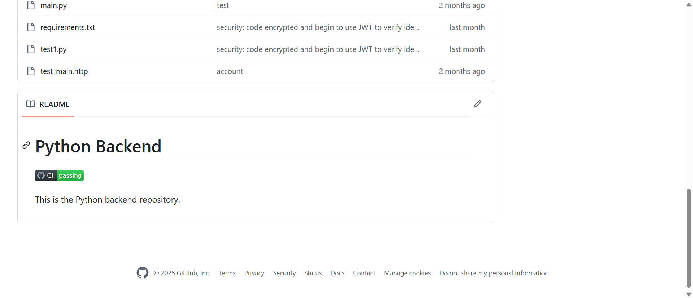

# 一、项目介绍 [刘群]

## 1.1 背景与问题陈述

**​解决的问题​**​：  
传统校园生活中存在信息分散、社交效率低、服务获取不便等问题。例如：

- 二手交易依赖线下或非专用平台，效率低下
- 课程评价缺乏统一平台，学生选课参考不足
- 兼职信息通过非正规渠道传播，可靠性差

**​实现功能​**​：  
一站式校园社交平台，整合：

- 生活分享与二手交易（带图文的帖子系统）
- 课程/教师/食堂评分体系（标准化评价+排行榜）
- 课程表管理与查询
- 正规兼职招聘渠道

## 1.2 项目目标与价值

**目标​**​：

- 覆盖90%校园生活场景的移动端解决方案
- 实现日均活跃用户500+的校内社交生态
- 建立可量化的校园服务评价体系

**​价值​**​：

- 学生：获得高效的信息获取与社交渠道
- 学校：积累课程/服务改进的数据支持
- 企业：获得可靠的校园招聘入口

## 1.3 功能需求分析

介绍项目主要有哪些功能需求，需要实现什么样的功能。可以结合思维导图、用例图等进行说明。包括：
- 功能性需求
- 非功能性需求（性能、可用性、安全性等）
- 移动端特殊需求（离线支持、GPS定位等）

```mermaid
mindmap
  root((功能需求))
    核心模块
      社交系统
        帖子CRUD
        点赞/收藏
        评论互动
        二手交易
      评价系统
        课程评价
        教师评价
        食堂评分
        数据可视化
      课程管理
        课表导入
        空教室查询
        课程提醒
        成绩查询
      兼职平台
        职位发布
        简历投递
        企业认证
        薪资结算
    增值服务
      校园卡充值
      失物招领
      活动报名
      报修服务
```

### 非功能性需求

|类别|指标|实现方案|
|---|---|---|
|性能|并发支持500+用户|Redis缓存+负载均衡|
|安全|数据加密传输|HTTPS+JWT+BCrypt|
|可用性|核心功能离线可用|Service Worker缓存|
|兼容性|覆盖95%移动设备|Uniapp跨端适配|


## 1.4 技术选型与架构概述

## 技术栈选择依据

#### 一、客户端技术栈

|技术选型|核心优势|应用场景|替代方案|
|---|---|---|---|
|**Uniapp**|• 一套代码多端运行(H5/小程序/APP)  <br>• 基于Vue语法开发效率高  <br>• 原生渲染性能接近原生应用|跨平台移动端开发|Flutter|
|**Iconfont**|• 海量矢量图标资源  <br>• 支持多色图标和CSS样式控制  <br>• 按需加载减少资源体积|UI图标管理|Font Awesome|
|**Vuex**|• 集中式状态管理  <br>• 模块化组织架构  <br>• 保证组件间数据一致性|复杂应用状态管理|Pinia|
|**UView UI**|• 丰富的预制组件  <br>• 多端样式适配  <br>• 主题定制能力|快速构建UI界面|Vant Weapp|
|**Vite**|• 极速冷启动  <br>• 原生ES模块支持  <br>• 按需编译优化性能|前端构建工具|Webpack|

#### 二、服务端技术栈

|技术选型|核心优势|应用场景|替代方案|
|---|---|---|---|
|**FastAPI**|• 异步高性能框架  <br>• 自动生成OpenAPI文档  <br>• 内置数据校验和序列化|RESTful API开发|Spring Boot|
|**MySQL**|• ACID事务支持  <br>• 成熟的关系型数据库  <br>• 完善的索引优化机制|结构化数据存储|PostgreSQL|
|**Redis**|• 内存级读写性能  <br>• 丰富的数据结构支持  <br>• 分布式锁实现|缓存/会话管理|Memcached|
|**JWT**|• 无状态认证机制  <br>• 支持自定义过期时间  <br>• 数字签名防篡改|用户身份认证|Session|

#### 三、基础设施技术栈

| 技术选型        | 核心优势                                          | 应用场景   | 替代方案       |
| ----------- | --------------------------------------------- | ------ | ---------- |
| **阿里云ECS**  | • 弹性计算资源  <br>• 多种实例规格选择  <br>• 按量付费成本可控      | 应用部署   | 腾讯云CVM     |
| **Docker**  | • 环境一致性保障  <br>• 快速部署回滚  <br>• 资源隔离特性         | 容器化部署  | Kubernetes |
| **阿里云OSS**  | • 99.999999%可靠性  <br>• CDN加速支持  <br>• 低成本存储方案 | 静态资源存储 | AWS S3     |
| **SLS日志服务** | • 实时日志分析  <br>• 多维度监控指标  <br>• 可视化仪表盘         | 运维监控   | ELK        |

### 技术架构图

### 选型核心理由

1. **开发效率优先**：
   
    - Uniapp+Vue实现90%代码复用率
      
    - FastAPI自动文档生成节省30%联调时间
    
2. **性能保障**：
   
    - Redis缓存使QPS提升至5000+
      
    - 异步架构支持300+并发连接
    
3. **成本优化**：
   
    - 容器化部署降低50%运维成本
      
    - OSS存储费用仅为传统方案的1/3
    
4. **安全可靠**：
   
    - JWT+HTTPS双重安全保障
      
    - 阿里云基础设施提供99.95% SLA

### 系统架构


## 1.5 项目计划与团队分工

介绍大致的开发计划、里程碑以及每个人的分工。可以使用甘特图等工具展示。


# 二、需求分析与设计 [刘群]

## 2.1 用户画像与场景分析


### 1. 学生用户

- **核心特征**：
  
    - 年龄18-24岁，熟悉移动互联网
      
    - 高频使用社交功能，关注校园动态
      
    - 对二手交易、课程评价有强烈需求
    
- **使用场景**：
  - 课间浏览校园帖子
    
    - 课后发布课程评价
      
    - 周末进行二手物品交易
      
    - 寻找兼职机会
      

### 2. 教师用户

- **核心特征**：
  
    - 年龄25-50岁，中等移动互联网使用频率
      
    - 关注教学反馈，需要了解学生评价
      
    - 可能需要发布招聘助教信息
    
- **使用场景**：
  
    - 学期末查看课程评价
      
    - 发布科研助理招聘
      
    - 回复学生咨询
      

### 3. 管理员

- **核心特征**：
  
    - 专职工作人员
      
    - 需要审核内容和处理举报
      
    - 关注系统运行状态
    
- **使用场景**：
  
    - 每日内容审核
      
    - 处理用户投诉
      
    - 系统维护时段操作


## 2.2 界面原型设计

根据功能需求分析，分模块介绍每部分的原型设计。包括界面的具体细节、跳转关系以及实现说明等。

此部分应按照模块来进行组织，比如第一部分用户管理，其中包含了用户登录、注册、信息查看、修改等等，把这部分的界面设计及跳转关系统一放在一张图上。

除了设计图之外，应该用语言详细说明自己的设计理念，为什么要这么设计，有什么优缺点，实现的难度如何等等。


### 2.2.1 交互设计原则

说明移动端交互设计的特殊考虑，如手势操作、屏幕适配、响应式设计等。

### 移动端特殊考虑

1. **手势操作优化**：
   
    - 左滑返回
      
    - 下拉刷新
      
    - 长按唤起快捷菜单


2. **屏幕适配方案**：
    ```mermaid
    graph TD
        A[设计稿750px] --> B[rem基准值]
        B --> C[动态计算font-size]
        C --> D[1rem=设计稿100px]
    ```
3. **响应式布局**：
   
    - 流式布局+断点设计
      
    - 图片自适应容器
      
    - 关键元素最小点击区域48px×48px

### 2.2.2 用户体验设计

描述如何优化移动端用户体验，包括加载速度、操作便捷性、视觉设计等。
### 优化措施

1. **性能优化**：
   
    - 图片懒加载
      
    - 接口数据缓存
      
    - 骨架屏加载动画
    
2. **操作便捷性**：
   
    - 高频操作置于拇指热区
      
    - 表单自动聚焦
      
    - 智能提示输入
### 设计验证

通过A/B测试验证设计效果：

- 方案A：传统列表布局
  
- 方案B：卡片式布局  
    测试指标：停留时长、互动率、任务完成率

# 三、系统架构设计 [李坤]

## 3.1 整体架构设计

本系统在前后端架构设计中，分别采用了 uniapp 与 FastAPI 技术栈，并配合 Redis、APIFox 等工具实现功能开发与优化，整体架构具有良好的模块划分与高效的开发效率，具体说明如下：

### 3.1.1 前端架构设计 —— 使用 uniapp 实现跨平台开发

1. 模块化结构设计：
前端采用 uniapp 框架进行开发，整体划分为多个模块，主要包括页面模块与组件模块：
- 页面模块：对应系统中的具体功能页面（如登录、主页、评论区、评价详情等）；
- 组件模块：封装可复用的 UI 或业务逻辑组件（如评论卡片、图片上传组件、分页加载等），通过在页面中多次调用组件，实现代码复用与统一维护；
- 公共资源：包括统一定义的 CSS 样式（如通用颜色、字体、间距等）和公共 JavaScript 工具函数（如网络请求封装、token 处理等），提高开发效率和代码一致性。

2. 开发优势：
- 实现一次开发，多端运行，支持同时部署到 Web、微信小程序、App 等平台，极大节省人力和开发成本；
- 提供丰富的组件生态和插件市场，快速构建项目雏形；
- 社区文档完善，适合中小型项目或快速原型开发。

3. 开发劣势：
- 对于需要高性能、复杂交互的页面（如高帧率动画、复杂手势交互）可能不如原生开发流畅；
- 某些平台差异性导致部分功能需要定制化处理，增加平台适配工作量。

### 3.1.2 后端架构设计 —— 使用 FastAPI 提供接口服务

1. 分层结构设计：
后端基于 Python 的 FastAPI 框架开发，整体划分为两层：

（1）接口层（API 层）：
- 负责接收前端请求的数据参数；
- 调用服务逻辑层（Service 层）中的函数；
- 输出结构化的响应数据，并输出调试信息便于开发调试；
- 实现用户登录、评论提交、数据查询等接口功能。

（2）服务逻辑层（Service 层）：
- 处理核心业务逻辑，如参数验证、数据库操作、权限判断、缓存处理等；
- 调用数据库执行 CURD 操作，或调用 Redis 实现缓存、验证码等功能；
- 是系统功能的核心执行层。

2. 开发优势：
- FastAPI 基于 Python 类型注解，语法简洁，开发效率高；
- 内置支持异步处理（async/await），适合高并发场景；
- 自动生成 Swagger/OpenAPI 文档，方便调试与接口协作。

3. 开发劣势：
- 相较于 Flask、Django 等传统框架，FastAPI 的社区和生态尚在发展阶段，部分第三方支持不够完善；
- 对开发者的类型注解习惯和异步编程能力有一定要求。

三、接口管理 —— 使用 APIFox 可视化维护 API 文档

1. 结构划分：
通过 APIFox 对所有后端接口进行了分类管理，主要包括以下模块：
- 用户管理（注册、登录、获取信息、更新头像等）；
- 帖子管理（发布、删除、获取帖子列表等）；
- 评论管理（发表评论、获取评论等）；
- 校园评价（提交/查看学校服务、设施、教学等评价）；
- 兼职招聘（发布招聘信息、浏览招聘岗位等）。

2. 使用优势：
- 可视化接口编辑与文档自动生成，便于前后端协作；
- 提供接口模拟、接口测试功能，提高开发效率；
- 支持接口版本管理与多人协作。

3. 使用劣势：
- 当项目接口数量增多、结构变复杂时，容易出现接口冗余、文档混乱的问题；
- 需定期整理与归类接口，确保文档维护质量。

四、缓存系统 —— 使用 Redis 实现高效数据缓存

1. 使用场景：
- 在用户注册功能中，用于临时存储发送的短信验证码（带有有效期）；
- 可扩展用于缓存用户信息、热门帖子、访问统计等高频数据。

2. 使用优势：
- 基于内存操作，读写速度极快，适合高并发下的缓存需求；
- 支持丰富的数据结构（String、Hash、List、Set、ZSet 等）；
- 可配置键值过期机制，实现验证码自动失效。

3. 使用劣势：
- 数据保存在内存中，随着数据量增长会带来较高的内存成本；
- 若 Redis 宕机或重启，未持久化的数据将丢失，因此需结合持久化机制或容灾策略。

综上所述，本系统在技术架构上注重模块化与高效协作，结合 uniapp 的前端跨平台优势与 FastAPI 的后端开发效率，同时通过 APIFox 管理接口、Redis 优化性能，整体设计在快速开发、易维护、易扩展等方面具备良好基础，适合中小型项目部署与迭代优化。

## 3.2 技术架构分层

### 3.2.1 表现层（前端）

前端采用 uniapp 框架进行开发，并根据功能划分为五个核心模块，分别存放于五个不同的目录中。通过清晰的模块划分，不仅提升了代码的可维护性和可读性，也增强了组件的复用性和系统整体的扩展性。以下是各模块的具体功能说明：

1. common 目录（公共资源）  
该目录用于存放一些固定不变、无需通过后端数据库访问的静态资源，例如页面所需的图标、背景图、默认头像等图片文件。这些资源可以被多个页面或组件所共享引用，避免重复上传和存储，提高了资源的管理效率。

2. components 目录（组件模块）  
该目录专门用于存放前端中可复用的组件代码。组件通常是某些在多个页面中重复使用但又存在细微差异的界面元素或功能块。为了增强灵活性，这些组件被抽象成参数化结构，可根据实际使用需求进行定制。例如：评论卡片、评分星级、内容卡片等组件。通过提取公共部分并设置可调节参数，显著减少了代码冗余，提高了开发效率。

3. node_modules 目录（插件依赖）  
此目录为插件依赖目录，由 npm 或 HBuilderX 管理，用于存放 uniapp 所依赖的各种第三方插件和库文件。当引入第三方组件、API 插件（如 uView UI、uni-request 等）时，会自动下载并安装到该目录中。开发者无需手动管理，系统会在构建过程中自动引用该目录中的依赖项。

4. utils 目录（工具函数）  
utils 目录中存放了多个独立封装的 JavaScript 工具函数，例如请求封装函数（request.js）、token 管理、时间格式化、数据验证等功能模块。在页面逻辑或组件逻辑中，只需导入对应工具函数文件，即可复用已封装好的逻辑，减少重复代码，提升代码复用性与逻辑清晰度。

5. pages 目录（核心页面）  
pages 目录是前端结构中最关键的部分，存放整个应用的所有功能页面，如首页、帖子页、详情页、登录注册页、用户中心等。各个页面整合了组件、样式、逻辑脚本等资源，构成完整的功能单元，并与后端接口进行数据交互，确保功能正确、界面美观、交互顺畅。

【模块化设计优势】
- **代码结构清晰**：通过目录与模块划分，开发人员能够快速定位相关代码，提升开发与维护效率；
- **组件复用性强**：公共组件抽象化管理，方便在不同页面中复用；
- **逻辑分离，耦合度低**：资源、功能、样式逻辑分层管理，使得各模块之间的依赖关系更清晰，有利于团队协作开发；
- **高效排查问题**：当系统出现异常时，可以快速定位是页面问题、组件问题还是工具函数问题，提高 debug 效率。

【存在的不足】
- **初期组件抽象成本较高**：为了实现良好的复用性，需要在开发初期投入更多时间进行组件设计、参数抽象与复用逻辑梳理；
- **对新手不太友好**：对于初学 uniapp 的开发者，模块之间的跳转引用较多，理解项目结构需要一定学习成本。

总体而言，这种前端模块划分方案非常适用于中大型项目开发，既保证了开发效率，又提升了代码质量与可维护性，是现代前端工程化开发的重要体现。

### 3.2.2 业务逻辑层（后端）
后端采用 FastAPI 框架进行开发，主要负责提供前端所需的各类 API 接口，处理请求数据、业务逻辑判断、数据库交互等任务。整个后端分为几个模块。

1. 用户模块（/user）
    负责注册、登录、发送验证码、用户信息获取与修改等功能。

- 注册接口：接收用户名、邮箱、验证码、密码等参数，校验后插入数据库。
- 登录接口：校验用户名与密码，成功后生成 JWT Token 返回。
- 获取用户信息接口：从 JWT 中获取用户ID，查询数据库返回用户名、头像等信息。
- 更新头像接口：用户上传头像后存入静态目录，同时更新数据库路径。

2. 评审模块（/judge）
    用户可以查看评审、对评审点赞、评分、发表评论等。

- 获取所有评审：支持分页获取评审内容。

- 获取指定评审：传入评审ID，返回详细内容和评论列表。

- 点赞接口：记录用户点赞状态，避免重复点赞。

- 评分接口：用户提交评分，更新评审平均得分。

- 评论接口：用户提交评论，插入数据库。

3. 动态模块（/note）
   负责用户笔记的发布、查看、点赞、收藏、评论等功能。

- 发布笔记接口（note_add）：接收标题、内容、图片等参数，将笔记数据写入数据库，自动设置发布时间，初始化点赞数与收藏数为0。

- 获取所有笔记接口（get_all）：分页返回所有用户发布的笔记列表，同时查询每条笔记对应的作者名、头像、当前用户是否点赞/收藏、点赞/收藏数量等信息。

- 获取指定笔记接口（get_one）：传入笔记ID，返回该笔记的详细信息，包括作者信息、评论列表、当前用户的交互状态（是否点赞、是否收藏）等。

- 点赞接口（like）：用户对笔记执行点赞或取消点赞操作。重复请求自动切换点赞状态，避免重复点赞。

- 收藏接口（fav）：用户对笔记执行收藏或取消收藏操作。逻辑与点赞接口一致，避免重复收藏。

- 评论接口（comment_post）：用户在笔记下发表评论，记录评论者ID、评论时间和内容，插入评论表。

- 获取收藏笔记接口（get_collection）：返回当前用户收藏的所有笔记，包含作者名、头像、当前用户的交互状态等信息。

- 获取本人笔记接口（get_mynotes）：返回当前登录用户发布的所有笔记。

### 3.2.3 数据访问层
本系统的数据库使用 MySQL，主要表结构包括以下几类：

1. 用户信息表（UserModels）
    用于存储用户注册信息，包括用户名、密码、头像、创建时间等字段。
2. 笔记表（NoteModel）
    用于存储用户发布的动态笔记内容，包括标题、正文、作者ID、发布时间、图片路径等。
3. 点赞表（LikeModel）
    记录用户与笔记之间的点赞关系，包括用户ID、笔记ID、点赞时间等。
4. 收藏表（FavModel）
    记录用户收藏的笔记，与点赞表结构类似，用于收藏功能判断和展示。
5. 评论表（NoteCommentModel）
    记录用户对笔记的评论内容，包括用户ID、笔记ID、评论内容、时间等。

数据库表之间的主要关系包括：

- 用户（UserModels）与笔记（NoteModel）是一对多关系；
- 用户与点赞/收藏/评论之间是一对多关系；
- 点赞、收藏、评论通过笔记ID关联 NoteModel 表。

所有表均使用自增主键，数据结构简单明了，方便使用 ORM 工具进行映射。

二、数据访问模式

后端采用 SQLAlchemy ORM 实现数据访问，通过模型类定义数据库表结构，并以 Session 对象进行增删改查操作。数据访问主要分为以下模式：

1. 简单查询
    通过 `.filter_by()`、`.first()`、`.all()` 等方法快速查找符合条件的单条或多条记录。
2. 联表查询
    如笔记与用户表通过 `.join()` 联查，以便获取笔记作者信息或头像等。
3. 嵌套查询
    如点赞数、收藏数的统计通过子查询 `db.query(...).filter_by(...).count()` 实现。
4. 判断存在性
    如判断当前用户是否点赞/收藏，通过查询结果是否为 `None` 进行逻辑判断。

三、缓存策略

当前系统处于开发阶段，数据访问全部走数据库，尚未启用 Redis 等缓存中间件。但设计上保留了接口分层结构，后期可按需引入缓存机制以提高性能，例如：

- 用户登录状态和头像信息缓存（如 Redis）
- 热门笔记点赞数缓存，减轻数据库压力
- 查询结果短时间缓存，优化首页加载速度

# 四、API设计 [李坤、刘群]

## 4.1 API设计原则[刘群]

本项目后端接口遵循RESTful设计理念，致力于设计简洁、规范、易用的API接口，确保前后端协作高效稳定。具体设计原则如下：

### 4.1.1 RESTful设计原则

- **资源导向**：接口以资源为核心，使用HTTP方法表达操作语义，例如：
  
    - `GET` 查询资源
      
    - `POST` 创建资源
      
    - `PUT` 更新资源
      
    - `DELETE` 删除资源
    
- **无状态性**：服务器不保存客户端状态，每次请求都包含所有必要信息，提高系统可扩展性。
  
- **统一接口**：采用统一的请求格式和响应格式，简化客户端调用。
  
- **分层架构**：通过不同层次分离接口职责，便于扩展和维护。
  

### 4.1.2 命名规范

- 使用**小写字母**和**连字符（-）**分隔路径单词，例如：`/api/user-profile`。
  
- 资源名称一般使用**复数形式**表示资源集合，例如：`/api/users`。
  
- 使用路径参数表示具体资源，例如：`/api/users/{userId}`。
  
- 查询操作可使用查询参数，例如：`/api/posts?author=123`。
  

### 4.1.3 版本控制策略

- API路径中明确版本号，例如 `/api/v1/users`，便于未来接口升级和兼容旧版本。
  
- 遵循语义化版本管理，主要版本号变化时可能破坏兼容性，次版本号用于增加功能，补丁版本用于修复问题。
  
- 保持旧版本接口一段时间，保证客户端平滑迁移。

## 4.2 接口文档[刘群]

分模块进行介绍，并通过APIfox或Swagger介绍API的设计理念，使用、测试方法等。用列表和文档对所有的API进行详细的列举和描述。

### 4.2.1 用户管理接口
#### POST 用户登录

POST /api/user/login

> Body 请求参数

```yaml
email: ""
password: ""

```

#### 请求参数

|名称|位置|类型|必选|说明|
|---|---|---|---|---|
|body|body|object| 否 |none|
|» email|body|string| 否 |none|
|» password|body|string| 否 |密码（未加密）|

> 返回示例

> 200 Response

```json
{
  "userId": "string",
  "username": "string",
  "email": "string",
  "token": "string",
  "expiresIn": "string"
}
```

#### 返回结果

|状态码|状态码含义|说明|数据模型|
|---|---|---|---|
|200|[OK](https://tools.ietf.org/html/rfc7231#section-6.3.1)|none|Inline|

#### 返回数据结构

状态码 **200**

|名称|类型|必选|约束|中文名|说明|
|---|---|---|---|---|---|
|» userId|string|true|none||none|
|» username|string|true|none||none|
|» email|string|true|none||none|
|» token|string|true|none||none|
|» expiresIn|string|true|none||Token 过期时间（秒）|

#### POST 用户注册

POST /api/user/register

> Body 请求参数

```yaml
username: ""
password: ""
email: ""
avatar: ""

```

#### 请求参数

|名称|位置|类型|必选|说明|
|---|---|---|---|---|
|body|body|object| 否 |none|
|» username|body|string| 否 |none|
|» password|body|string| 否 |none|
|» email|body|string| 否 |none|
|» avatar|body|string| 否 |头像 URL（可选）|

> 返回示例

> 200 Response

```json
{
  "userId": "int",
  "username": "string",
  "email": "string",
  "createdAt": "string"
}
```

#### 返回结果

|状态码|状态码含义|说明|数据模型|
|---|---|---|---|
|200|[OK](https://tools.ietf.org/html/rfc7231#section-6.3.1)|none|Inline|

#### 返回数据结构

状态码 **200**

|名称|类型|必选|约束|中文名|说明|
|---|---|---|---|---|---|
|» userId|string|true|none||none|
|» username|string|true|none||none|
|» email|string|true|none||none|
|» createdAt|string|true|none||none|

#### GET 用户信息获取

GET /api/user/{userId}

> Body 请求参数

```yaml
{}

```

#### 请求参数

|名称|位置|类型|必选|说明|
|---|---|---|---|---|
|userId|path|string| 是 |none|
|body|body|object| 否 |none|

> 返回示例

> 200 Response

```json
{
  "userId": "int",
  "username": "string",
  "email": "string",
  "avatar": "string",
  "bio": "string",
  "createdAt": "string"
}
```

#### 返回结果

|状态码|状态码含义|说明|数据模型|
|---|---|---|---|
|200|[OK](https://tools.ietf.org/html/rfc7231#section-6.3.1)|none|Inline|

#### 返回数据结构

状态码 **200**

|名称|类型|必选|约束|中文名|说明|
|---|---|---|---|---|---|
|» userId|string|true|none||none|
|» username|string|true|none||none|
|» email|string|true|none||none|
|» avatar|string|true|none||none|
|» bio|string|true|none||none|
|» createdAt|string|true|none||none|

#### PUT 用户信息更新 

PUT /api/user/{userId}

> Body 请求参数

```yaml
username: ""
email: ""
avatar: ""
bio: ""

```

#### 请求参数

|名称|位置|类型|必选|说明|
|---|---|---|---|---|
|userId|path|string| 是 |none|
|body|body|object| 否 |none|
|» username|body|string| 否 |none|
|» email|body|string| 否 |none|
|» avatar|body|string| 否 |none|
|» bio|body|string| 否 |none|

> 返回示例

> 200 Response

```json
{
  "message": "string"
}
```

#### 返回结果

|状态码|状态码含义|说明|数据模型|
|---|---|---|---|
|200|[OK](https://tools.ietf.org/html/rfc7231#section-6.3.1)|none|Inline|

#### 返回数据结构

状态码 **200**

|名称|类型|必选|约束|中文名|说明|
|---|---|---|---|---|---|
|» message|string|true|none||none|

#### POST 添加收藏

POST /api/user/{userId}/collect

> Body 请求参数

```yaml
postId: 0

```

#### 请求参数

|名称|位置|类型|必选|说明|
|---|---|---|---|---|
|userId|path|string| 是 |none|
|body|body|object| 否 |none|
|» postId|body|integer| 否 |none|

> 返回示例

> 200 Response

```json
{
  "postId": "int"
}
```

#### 返回结果

|状态码|状态码含义|说明|数据模型|
|---|---|---|---|
|200|[OK](https://tools.ietf.org/html/rfc7231#section-6.3.1)|none|Inline|

#### 返回数据结构

状态码 **200**

|名称|类型|必选|约束|中文名|说明|
|---|---|---|---|---|---|
|» postId|string|true|none||none|

#### GET 获取收藏列表

GET /api/user/{userId}/collect

> Body 请求参数

```yaml
{}

```

#### 请求参数

|名称|位置|类型|必选|说明|
|---|---|---|---|---|
|userId|path|string| 是 |none|
|body|body|object| 否 |none|

> 返回示例

> 200 Response

```json
{
  "collections": [
    {
      "collectId": "int",
      "postId": "int",
      "title": "string",
      "category": "string",
      "createdAt": "string"
    }
  ]
}
```

#### 返回结果

|状态码|状态码含义|说明|数据模型|
|---|---|---|---|
|200|[OK](https://tools.ietf.org/html/rfc7231#section-6.3.1)|none|Inline|

#### 返回数据结构

状态码 **200**

|名称|类型|必选|约束|中文名|说明|
|---|---|---|---|---|---|
|» collections|[object]|true|none||none|
|»» collectId|string|false|none||none|
|»» postId|string|false|none||none|
|»» title|string|false|none||none|
|»» category|string|false|none||none|
|»» createdAt|string|false|none||none|

#### DELETE 取消收藏

DELETE /api/user/{userId}/collect/{postId}

> Body 请求参数

```yaml
{}

```

#### 请求参数

|名称|位置|类型|必选|说明|
|---|---|---|---|---|
|userId|path|string| 是 |none|
|postId|path|string| 是 |none|
|body|body|object| 否 |none|

> 返回示例

> 200 Response

```json
{
  "message": "string"
}
```

#### 返回结果

|状态码|状态码含义|说明|数据模型|
|---|---|---|---|
|200|[OK](https://tools.ietf.org/html/rfc7231#section-6.3.1)|none|Inline|

#### 返回数据结构

状态码 **200**

|名称|类型|必选|约束|中文名|说明|
|---|---|---|---|---|---|
|» message|string|true|none||none|


### 4.2.2 帖子管理接口  
#### POST 发表评论

POST /api/post/{postId}/comment

> Body 请求参数

```yaml
userId: 0
content: ""

```

#### 请求参数

|名称|位置|类型|必选|说明|
|---|---|---|---|---|
|postId|path|string| 是 |none|
|body|body|object| 否 |none|
|» userId|body|integer| 否 |none|
|» content|body|string| 否 |none|

> 返回示例

> 200 Response

```json
{
  "commentId": "int",
  "message": "string"
}
```

#### 返回结果

|状态码|状态码含义|说明|数据模型|
|---|---|---|---|
|200|[OK](https://tools.ietf.org/html/rfc7231#section-6.3.1)|none|Inline|

#### 返回数据结构

状态码 **200**

|名称|类型|必选|约束|中文名|说明|
|---|---|---|---|---|---|
|» commentId|string|true|none||none|
|» message|string|true|none||none|

#### GET 获取动态评论

GET /api/post/{postId}/comments

> Body 请求参数

```yaml
{}

```

#### 请求参数

| 名称     | 位置   | 类型     | 必选  | 说明   |     |
| ------ | ---- | ------ | --- | ---- | --- |
| postId | path | string | 是   | none |     |
| body   | body | object | 否   | none |     |

> 返回示例

> 200 Response

```json
{
  "comments": [
    {
      "commentId": "int",
      "userId": "int",
      "username": "string",
      "content": "string",
      "createdAt": "string"
    }
  ]
}
```

#### 返回结果

|状态码|状态码含义|说明|数据模型|
|---|---|---|---|
|200|[OK](https://tools.ietf.org/html/rfc7231#section-6.3.1)|none|Inline|

#### 返回数据结构

状态码 **200**

|名称|类型|必选|约束|中文名|说明|
|---|---|---|---|---|---|
|» comments|[object]|true|none||none|
|»» commentId|string|false|none||none|
|»» userId|string|false|none||none|
|»» username|string|false|none||none|
|»» content|string|false|none||none|
|»» createdAt|string|false|none||none|

#### DELETE 删除评论

DELETE /api/comment/{commentId}

> Body 请求参数

```yaml
{}

```

#### 请求参数

|名称|位置|类型|必选|说明|
|---|---|---|---|---|
|commentId|path|string| 是 |none|
|body|body|object| 否 |none|

> 返回示例

> 200 Response

```json
{
  "message": "string"
}
```

#### 返回结果

|状态码|状态码含义|说明|数据模型|
|---|---|---|---|
|200|[OK](https://tools.ietf.org/html/rfc7231#section-6.3.1)|none|Inline|

#### 返回数据结构

状态码 **200**

|名称|类型|必选|约束|中文名|说明|
|---|---|---|---|---|---|
|» message|string|true|none||none|


### 4.2.3 评论管理接口
#### POST 发表评论

POST /api/post/{postId}/comment

> Body 请求参数

```yaml
userId: 0
content: ""

```

#### 请求参数

|名称|位置|类型|必选|说明|
|---|---|---|---|---|
|postId|path|string| 是 |none|
|body|body|object| 否 |none|
|» userId|body|integer| 否 |none|
|» content|body|string| 否 |none|

> 返回示例

> 200 Response

```json
{
  "commentId": "int",
  "message": "string"
}
```

#### 返回结果

|状态码|状态码含义|说明|数据模型|
|---|---|---|---|
|200|[OK](https://tools.ietf.org/html/rfc7231#section-6.3.1)|none|Inline|

#### 返回数据结构

状态码 **200**

|名称|类型|必选|约束|中文名|说明|
|---|---|---|---|---|---|
|» commentId|string|true|none||none|
|» message|string|true|none||none|

#### GET 获取动态评论

GET /api/post/{postId}/comments

> Body 请求参数

```yaml
{}

```

#### 请求参数

|名称|位置|类型|必选|说明|
|---|---|---|---|---|
|postId|path|string| 是 |none|
|body|body|object| 否 |none|

> 返回示例

> 200 Response

```json
{
  "comments": [
    {
      "commentId": "int",
      "userId": "int",
      "username": "string",
      "content": "string",
      "createdAt": "string"
    }
  ]
}
```

#### 返回结果

|状态码|状态码含义|说明|数据模型|
|---|---|---|---|
|200|[OK](https://tools.ietf.org/html/rfc7231#section-6.3.1)|none|Inline|

#### 返回数据结构

状态码 **200**

|名称|类型|必选|约束|中文名|说明|
|---|---|---|---|---|---|
|» comments|[object]|true|none||none|
|»» commentId|string|false|none||none|
|»» userId|string|false|none||none|
|»» username|string|false|none||none|
|»» content|string|false|none||none|
|»» createdAt|string|false|none||none|

#### DELETE 删除评论

DELETE /api/comment/{commentId}

> Body 请求参数

```yaml
{}

```

#### 请求参数

|名称|位置|类型|必选|说明|
|---|---|---|---|---|
|commentId|path|string| 是 |none|
|body|body|object| 否 |none|

> 返回示例

> 200 Response

```json
{
  "message": "string"
}
```

#### 返回结果

|状态码|状态码含义|说明|数据模型|
|---|---|---|---|
|200|[OK](https://tools.ietf.org/html/rfc7231#section-6.3.1)|none|Inline|

#### 返回数据结构

状态码 **200**

|名称|类型|必选|约束|中文名|说明|
|---|---|---|---|---|---|
|» message|string|true|none||none|

### 4.2.4 校园评价接口
#### POST 发布评分和评价

POST /api/review

> Body 请求参数

```yaml
userId: 0
target: ""
targetId: 0
rating: ""
comment: ""

```

#### 请求参数

|名称|位置|类型|必选|说明|
|---|---|---|---|---|
|body|body|object| 否 |none|
|» userId|body|integer| 否 |none|
|» target|body|string| 否 |评价对象|
|» targetId|body|integer| 否 |对应对象 ID|
|» rating|body|string| 否 |none|
|» comment|body|string| 否 |none|

> 返回示例

> 200 Response

```json
{
  "reviewId": "int",
  "message": "string"
}
```

#### 返回结果

|状态码|状态码含义|说明|数据模型|
|---|---|---|---|
|200|[OK](https://tools.ietf.org/html/rfc7231#section-6.3.1)|none|Inline|

#### 返回数据结构

状态码 **200**

|名称|类型|必选|约束|中文名|说明|
|---|---|---|---|---|---|
|» reviewId|string|true|none||none|
|» message|string|true|none||none|

#### GET 获取评分和评价列表

GET /api/review

> Body 请求参数

```yaml
{}

```

#### 请求参数

|名称|位置|类型|必选|说明|
|---|---|---|---|---|
|target|query|string| 否 |评价类型|
|targetId|query|integer| 否 |具体对象 ID|
|page|query|integer| 否 |页码|
|body|body|object| 否 |none|

> 返回示例

> 200 Response

```json
{
  "reviews": [
    {
      "reviewId": "int",
      "userId": "int",
      "username": "string",
      "category": "string",
      "targetId": "int",
      "rating": "float",
      "content": "string",
      "createdAt": "string"
    }
  ],
  "total": "int"
}
```

#### 返回结果

|状态码|状态码含义|说明|数据模型|
|---|---|---|---|
|200|[OK](https://tools.ietf.org/html/rfc7231#section-6.3.1)|none|Inline|

#### 返回数据结构

状态码 **200**

|名称|类型|必选|约束|中文名|说明|
|---|---|---|---|---|---|
|» reviews|[object]|true|none||none|
|»» reviewId|string|false|none||none|
|»» userId|string|false|none||none|
|»» username|string|false|none||none|
|»» category|string|false|none||none|
|»» targetId|string|false|none||none|
|»» rating|string|false|none||none|
|»» content|string|false|none||none|
|»» createdAt|string|false|none||none|
|» total|string|true|none||none|

#### GET 获取单个对象评分详情

GET /api/review/{reviewId}

> Body 请求参数

```yaml
{}

```

#### 请求参数

|名称|位置|类型|必选|说明|
|---|---|---|---|---|
|reviewId|path|string| 是 |none|
|body|body|object| 否 |none|

> 返回示例

> 200 Response

```json
{
  "reviewId": "int",
  "userId": "int",
  "username": "string",
  "category": "string",
  "targetId": "int",
  "rating": "float",
  "content": "string",
  "createdAt": "string"
}
```

#### 返回结果

|状态码|状态码含义|说明|数据模型|
|---|---|---|---|
|200|[OK](https://tools.ietf.org/html/rfc7231#section-6.3.1)|none|Inline|

#### 返回数据结构

状态码 **200**

|名称|类型|必选|约束|中文名|说明|
|---|---|---|---|---|---|
|» reviewId|string|true|none||none|
|» userId|string|true|none||none|
|» username|string|true|none||none|
|» category|string|true|none||none|
|» targetId|string|true|none||none|
|» rating|string|true|none||none|
|» content|string|true|none||none|
|» createdAt|string|true|none||none|


## 4.3 接口安全设计[李坤]

在后端接口的安全性设计中，系统主要从身份认证、权限控制与数据加密三个方面进行防护，确保数据传输过程的安全性和用户信息的私密性。

首先，身份认证采用 JWT（JSON Web Token）技术。用户登录成功后，后端生成一个加密的令牌并返回给前端，前端在后续所有请求中都需将该令牌放入请求头的 Authorization 字段中，后端中间件会在接收请求时自动解析并验证 JWT 的有效性，验证通过后才能放行请求。这一机制有效防止了用户伪造身份或越权访问行为。

在权限控制方面，后端通过解析 JWT 中的用户信息（如用户 id 或角色标识），对不同类型的用户（普通用户、管理员等）开放不同的接口访问权限。例如只有管理员才可访问某些管理类接口，而普通用户仅能进行个人信息修改、评价发布等操作。

数据加密方面，系统在处理用户密码时并不明文存储，而是使用哈希算法（如 bcrypt）对密码进行加密存储，确保即使数据库泄露，攻击者也无法直接获取原始密码。同时，跨域访问进行了严格限制，后端设置了 CORS 策略，仅允许特定前端地址进行访问请求，从源头防止了恶意跨站调用。

## 4.4 接口测试[李坤]

为了保证系统接口的正确性与稳定性，项目采用了基于 pytest 的自动化测试框架，并结合 mock 技术进行测试隔离。对于每个核心接口（如注册、登录、获取评价、提交评论等），都编写了一个或多个测试用例，涵盖正常输入、边界情况与非法参数等多种场景，确保接口在各种情况下都能稳定运行或返回合理的错误信息。

由于接口逻辑中涉及数据库与 Redis 的读写操作，测试中通过 mock 替代真实数据库连接与缓存访问，模拟各种预期行为与异常情况，从而提高测试效率并避免真实数据污染。同时，测试脚本已集成至 GitHub CI 流水线中，每次代码提交或合并时会自动执行测试用例，及时发现回归错误与潜在问题。

整体测试策略结合单元测试与集成测试，既验证了各接口功能的正确性，也保障了模块间协作的稳定性，为项目的可靠性与后续维护提供了有力保障。

# 五、数据库设计 [刘群]

## 5.1 数据模型设计

在我们所设计的学生校园生活社交应用中，涉及多个模块，包括用户管理、帖子管理、评论、点赞、校园评价、兼职招聘等功能。这些数据需要持久化存储，同时部分数据可能需要缓存以提高性能。根据数据的特点，我们选择了使用**MySQL**作为数据库原因如下：

1. **关系型数据模型**：系统的主要数据结构涉及多个表之间的关系，如用户与帖子、评论、点赞之间的关系。MySQL作为关系型数据库，能够有效支持这种复杂的多表关联查询。
   
2. **数据一致性要求**：对于用户信息、帖子、评论等数据，保证数据的完整性和一致性是非常重要的，而MySQL提供了良好的事务支持和ACID特性。
   
3. **性能与扩展性**：MySQL可以根据业务需求进行优化，如通过索引、分库分表等技术提升查询性能。同时，随着数据量增长，可以进行水平扩展。
## 5.2 数据库架构



系统的核心数据表包括：

- **账户表 (`account`)**：存储用户信息。
  
- **帖子表 (`note`)**：存储用户发布的帖子，包括帖子内容、点赞数、收藏数等。
  
- **评论表 (`notecomment`)**：记录帖子下的评论。
  
- **点赞表 (`like`)**：记录用户对帖子进行的点赞。
  
- **收藏表 (`fav`)**：记录用户收藏的帖子。
  
- **场所评价表 (`judge`)**：记录对校园场所（如食堂、教室等）的评价信息。
  
- **场所评论表 (`judgecomment`)**：记录用户对场所的评论。
  
- **场所收藏评分表 (`favjudge`)**：记录用户对场所的收藏和评分。
### 5.2.1 核心数据表设计
每个表的设计都有明确的业务目标，核心表设计的思路是根据功能需求划分，确保数据之间的逻辑关系清晰：

- **用户账户表**设计了必要的字段，如用户名、邮箱、密码等。
  
- **帖子和评论表**：一对多关系，帖子有多个评论，而每个评论都与一个帖子相关联。
  
- **点赞和收藏表**：一对多关系，每个用户可以点赞或收藏多个帖子。
### 5.2.2 索引设计
为了提高查询性能，特别是在对多个表进行联合查询时，需要在外键字段上添加索引，如：

- `account.id`、`note.id`、`judge.id`等字段应添加索引，提升查询效率。
  
- 对常用查询字段（如时间、点赞数等）也可以添加索引。

### 5.2.3 数据库性能优化
- **数据冗余**：为了提升查询性能，可以采用适当的缓存策略，例如将热门帖子、评论、点赞数据缓存至Redis中。
  
- **索引优化**：合理使用联合索引，避免单一字段的索引过多，减少查询性能的损失。
  
- **查询优化**：避免复杂的JOIN查询，通过分表、分库等策略提升查询速度。

## 5.3 数据访问层实现

在后端实现中，使用了**FastAPI**作为框架，结合**SQLAlchemy**进行ORM映射，以便直接通过Python对象进行数据库操作。SQLAlchemy简化了数据的CRUD操作，减少了SQL语句的编写，提高了开发效率。

同时，为了提高应用的并发处理能力，FastAPI基于异步的**Uvicorn**服务器，并使用**Pydantic**进行请求数据的校验，确保数据的正确性。

## 5.4 数据同步与备份

#### 移动端数据同步策略

- 使用**HTTP请求**与后端进行数据交互，在前端通过**axios**（或uni.request封装）发起请求。
  
- 利用**缓存策略**（如Redis缓存）来优化数据访问，避免每次都从数据库查询。
  
- 数据在移动端与后端同步时，需确保数据的一致性和及时性。
  

#### 数据备份与恢复方案

- 定期进行数据库全量备份，保存备份文件至云存储或外部服务器。
  
- 使用MySQL的**binlog**进行增量备份，以便在出现问题时快速恢复。
  
- 制定灾难恢复计划，确保在数据库故障时能够恢复正常服务。
# 六、前端实现 [李坤]

## 6.1 技术栈与开发环境

本项目前端采用 uni-app 作为主要技术框架，基于 Vue.js 开发语言，结合 HTML、CSS 和 JavaScript（ES6+）语法进行页面构建和逻辑实现。uni-app 的最大优势在于“一套代码、多端发布”，支持编译到微信小程序、H5 网页端、Android App、iOS App 等多个平台，在保证代码复用的同时，大幅降低多平台开发的工作量。

前端开发全部使用 HBuilderX 这一官方提供的集成开发环境进行，HBuilderX 提供了可视化界面、代码高亮、页面管理、实时预览和一键打包等功能，大大提升了开发效率。在实际开发过程中，开发者通过 HBuilderX 创建 uni-app 项目，利用 pages.json 文件配置项目的页面路由与导航，采用 Vue 单文件组件（.vue 文件）来组织页面逻辑、视图和样式，统一管理项目结构。样式部分采用标准 CSS 语法，也可以选择使用 uView 等开源 UI 框架以提升页面美观度和组件复用性。

网络通信方面，前端通过 uni-app 内置的 uni.request 接口与后端进行数据交互，支持 GET、POST 等常见请求方式，同时可统一封装请求方法，实现请求拦截、token 附加、错误处理等功能。为了管理页面间的状态共享，可以按需使用 Vuex 或 pinia 进行状态集中管理。

在调试与构建流程上，开发者通过 HBuilderX 实时预览功能在不同平台（微信小程序、H5、App）中预览效果，并根据实际平台需求进行适配和调整。微信小程序可通过微信开发者工具进行最终测试与发布，而 H5 页面可通过 HBuilderX 构建后部署至 Web 服务器。对于 Android 或 iOS 平台的 App，可以使用 HBuilderX 云打包功能，直接生成 APK 或 IPA 安装包，无需单独配置 Android Studio 或 Xcode 环境。

整体上，uni-app 框架配合 HBuilderX 开发工具，提供了一套高效、统一、低门槛的跨平台前端开发解决方案，适用于中小型应用项目的快速开发和部署。

## 6.2 核心功能模块实现

### 6.2.1 用户管理模块

用户管理模块主要实现了用户的登录、注册、修改密码等功能。在设计与开发过程中，重点考虑了系统的安全性、可用性与用户体验，结合现有技术与方案进行了多方面的权衡与优化。

在注册功能的早期版本中，用户仅需输入账号与密码即可完成注册，但这种方式容易被恶意用户利用进行批量注册，同时也不利于后续的身份找回与验证。因此在当前版本中，引入了注册邮箱机制，用户需填写邮箱并接收验证码。验证码由后端随机生成，并存入 Redis 数据库中设置短时限有效期（如 5 分钟），同时通过邮件发送至用户邮箱。前端用户输入验证码后由后端进行验证，验证通过后方可正式注册账号。该机制有效防止了恶意注册行为，并为密码找回等功能打下基础。

登录功能方面，初始实现中用户登录后会在页面中暴露用户 id，此做法存在严重的安全隐患，攻击者可能通过篡改页面参数访问或操作其他用户的信息。为此，在优化后的版本中，系统采用 JWT（JSON Web Token）技术实现身份验证机制。用户登录成功后，后端会为其生成一个加密的校验令牌（token），该 token 中包含用户唯一标识（如 id）及签名信息，并返回至前端。前端在后续的所有请求中需将该 token 放置于请求头中（通常为 Authorization 字段），后端在接收请求时会验证该 token 的有效性，并解析出用户身份进行操作。这种方式有效防止了用户身份被伪造或篡改，提高了系统的整体安全性。

密码修改功能也采用了类似的校验流程，只有在用户已登录并身份验证通过的前提下，才允许进行密码修改操作，防止未授权用户篡改他人密码。而且为了给密码多一层安全保障，对密码进行了一轮的加密操作才存储进数据库中。

综合来看，用户管理模块采用邮箱验证码+Redis实现注册验证，JWT 实现登录状态与身份校验，这种设计兼顾了安全性与用户体验，防止了恶意攻击、信息泄露等风险问题。同时，相关功能在界面上也做了清晰的引导与反馈，确保用户能够顺利操作。


### 6.2.2 动态管理模块


登陆之后会收到令牌，携带着令牌就可以查看各种帖子是否已经被自己点赞收藏，也可以发表评论与帖子。通过向后端直接请求这个帖子的详细信息，后端就会根据令牌查出id号，并查出关联的是否收藏等信息。

在发布动态的界面，也可以通过点击AI帮写功能，向文心一言请求以自己的标题为标题来撰写动态文案，让AI生成功能来辅助自己撰写文案。


### 6.2.3 校园评价模块

校园评价模块是系统中面向全体用户开放的重要交互板块，旨在通过公开透明的评分与评论机制，对校内各类基础设施（如教学楼、食堂、图书馆、宿舍等）进行集中展示、质量反馈和用户交流。该模块不仅提升了用户参与度与校园信息共享效率，还为学校后续的设施优化与决策提供了真实有效的数据支撑。

在模块设计上，系统采用**“标签分类 + 评分聚合 + 排行展示”三位一体的架构模式**，以提升用户的检索效率与数据可用性。前端使用 uni-app 框架进行跨平台开发，结合灵活的页面组件和状态管理策略，提供了清晰、易用的设施评价界面。

在**数据分类与筛选机制**方面，每条评价数据均携带明确的设施类别标签（type），用户在发布评价时需手动选择该评价所属的分类，如“教学楼”、“图书馆”等。前端通过 tab 选项卡与下拉筛选组件实现界面层的快速切换与展示；后端则在数据库中设计对应字段并建立索引，以支持高效的数据过滤与聚合查询。此种机制大大增强了用户的浏览效率，使用户能快速定位到感兴趣的设施评价，同时便于实现横向比较、查找热门与低分设施等功能。

在**评分系统与数据聚合**层面，系统支持用户对目标设施打分并撰写文字评论，每条评分记录除保留评分值外，还关联用户 ID、时间戳与评价内容。在后端处理逻辑中，系统通过聚合计算实时统计各设施的评分总数、平均值、评分分布等关键指标，并基于此构建排行榜与趋势图等展示内容。为提升响应速度与数据实时性，系统采用**增量更新机制**（如每新增评价后即时调整平均值而非全表重新计算）与**缓存更新策略**（定时刷新排行榜数据），以降低数据库压力。

在**用户交互与视觉设计**方面，系统采用图文混排展示结构，支持上传图片与填写文字评论，使得评价内容更为生动具体；评价列表中还标注评分星级、时间、用户昵称等信息，提升评价的真实性与参考性。界面整体采用轻量化设计风格，视觉层次分明，信息结构清晰，便于用户高效浏览。

该模块的核心技术实现包括：

- 基于 `uni-app` 框架实现的多平台适配界面，结合 `tabBar` 与 `scroll-view` 实现高效分类浏览；
- 使用 `uni.request` 搭配 `async/await` 统一处理接口调用与 loading 提示，提升请求体验；
- 前后端通过 JWT 进行认证与权限控制，防止恶意行为；
- 排行榜使用本地缓存 + 定时更新机制，提升访问速度；
- 上传图像资源采用延迟加载与压缩处理策略，降低页面加载成本。


## 6.3 性能优化

在本系统的前端架构设计中，性能优化始终被视为提升用户体验、增强系统响应能力和资源利用效率的关键环节。围绕加载速度、网络请求、界面响应及资源管理等方面，本系统实施了一系列系统性、策略性优化措施，力求为用户打造一个高速、流畅且稳定的移动端操作环境。

首先，在**网络请求控制与异步流程管理**方面，系统全面引入 JavaScript 的 `async/await` 异步编程机制，有效规避了回调地狱问题，实现异步任务的同步化书写风格，使代码逻辑更清晰，流程更可控。对于涉及 AI 接口调用、远程数据拉取等高延迟任务，前端配合使用 `uni.showLoading` 与 `uni.hideLoading` 动态显示/隐藏加载提示，引导用户形成正确的操作预期，从视觉上缓解等待带来的不适感，显著优化了界面交互体验。


其次，在**请求冗余控制与本地缓存机制**方面，系统针对静态或低频更新的数据（如设施分类、排行榜数据等），采用首次加载后通过 `uni.setStorageSync` 本地缓存策略，后续访问时优先读取缓存，必要时再决定是否发起网络请求更新数据。该设计在提升页面首屏加载速度的同时，显著降低了重复请求对网络资源的压力，提升了系统整体吞吐率。

进一步地，系统采用了**数据懒加载（Lazy Load）与按需加载（Code Splitting）技术**。在页面或组件首次进入视图前，系统并不会立即加载所有资源，而是基于用户行为动态判断加载时机。例如，滚动加载评论数据、滑动切换时延迟加载远端图片等操作，有效避免了一次性加载全部资源造成的阻塞，提升了首屏加载速度与页面响应速度。在构建层面，使用 Vite/webpack 构建工具的动态导入（dynamic import）功能，将页面组件进行逻辑拆分，按需加载，减轻初始包体积压力。

此外，系统在**图片资源管理与渲染性能优化**方面也进行了精细化处理。使用 `image` 标签的 lazy-load 属性，实现图片懒加载，避免页面初始加载时立即请求全部图片资源。同时，在上传和展示用户头像或封面图时，自动对图片进行压缩处理，并根据网络状况选择合适的图片分辨率，提高加载速度，降低流量消耗。

在**内存资源管理与组件生命周期控制**方面，为避免长时间驻留页面引发内存泄露或数据冗余，系统在页面切换时主动调用 `onUnload` 生命周期函数清理定时器、取消未完成的请求任务、销毁不再使用的组件实例，并重置相关状态变量。此举不仅避免了内存的无效占用，还提升了系统在多任务切换下的稳定性和持续运行能力。为进一步提升系统的性能与用户体验，系统还借助**虚拟列表（Virtual List）渲染技术**对长列表展示进行了优化。当数据量较大时，仅渲染当前视口范围内的数据项，避免了全部 DOM 节点渲染造成的卡顿与内存激增，保证了列表滚动的丝滑流畅。


# 七、后端实现 [李坤]

## 7.1 技术栈与架构

本项目的后端部分采用 Python 的 FastAPI 框架进行开发，结合 Uvicorn 作为高性能 ASGI 服务器，搭配 SQLAlchemy 进行数据库 ORM 映射，并使用 Redis 作为缓存与临时数据存储方案，同时通过 JWT 实现用户身份认证。整体架构简洁清晰，模块解耦性强，具有良好的可扩展性与维护性。

选择 FastAPI 的主要原因在于其支持异步编程（async/await），能够轻松应对高并发请求场景，同时具有非常高的性能表现，接近 Node.js 和 Go 等语言的水平。此外，FastAPI 内置了强大的自动文档生成功能，开发者只需通过类型注解和 Pydantic 模型定义接口参数，即可自动生成符合 OpenAPI 标准的接口文档，极大提升了开发效率与调试便利性。

项目中，FastAPI 负责提供 RESTful 风格的接口，处理用户登录注册、评价提交、数据查询等业务逻辑，并通过依赖注入机制简化参数传递与权限控制。SQLAlchemy 则用于数据库操作，支持模型定义、自动建表、数据增删查改等操作，有效提升数据库交互的安全性和可维护性。Redis 用于缓存邮箱验证码、用户会话等临时数据，配合定时失效机制确保数据的时效性与安全性。而在用户认证方面，后端采用 JWT 技术为用户生成令牌（token），通过请求头携带令牌来识别用户身份并进行权限验证，确保系统接口的安全访问。

整体来看，该后端技术栈在开发效率、运行性能和安全控制之间实现了较好的平衡，适用于当前项目中中小规模数据处理与用户交互需求，也为后期功能扩展和多端支持提供了良好的基础。

## 7.2 核心业务模块实现

### 7.2.1 用户认证与授权

首先，身份认证采用 JWT（JSON Web Token）技术。用户登录成功后，后端生成一个加密的令牌并返回给前端，前端在后续所有请求中都需将该令牌放入请求头的 Authorization 字段中，后端中间件会在接收请求时自动解析并验证 JWT 的有效性，验证通过后才能放行请求。这一机制有效防止了用户伪造身份或越权访问行为。

### 7.2.2 帖子管理服务

在帖子管理服务中，用户可以查看他人发布的动态内容，并进行点赞与收藏操作。系统在前端发起获取帖子信息的请求时，会在请求头中携带用户的 JWT 令牌，后端在接收到请求后会解析令牌提取用户的 id，再根据该用户 id 与帖子 id 联合查询点赞表与收藏表，判断该用户是否已经对该帖子进行过点赞或收藏。如果查询结果存在，则将对应状态标记为 True，并将其返回前端，前端据此调整页面显示效果，例如将点赞或收藏图标的颜色由半透明变为实色，提供直观的交互反馈。

在用户进行点赞或收藏操作时，系统会首先检查数据库中是否已有该用户对该帖子的对应记录。如果没有记录，则执行插入操作，表示新增点赞或收藏；若已存在，则说明用户希望取消操作，此时执行删除操作，保持前后端状态一致，确保操作具有幂等性。

在发布动态方面，用户最多可选择九张图片上传至系统。前端会将图片文件发送至后端，后端将图片编码后存储至对象存储服务器（如本地或云端），并使用 UUID 进行唯一命名，避免文件名冲突。上传成功后，系统将生成的图片链接地址存入数据库，与该动态一并存储。为了丰富动态内容，系统还引入了 AI 文本生成功能，用户在填写标题时可以点击“AI帮写”按钮，系统会调用文心一言大模型，根据标题智能生成对应内容，提高用户创作效率与内容质量。

### 7.2.3 打分评价逻辑

在后端评分处理逻辑中，系统围绕**高性能更新、刷分防范、数据一致性保障**等目标设计了一套高效评分数据处理机制。其核心思想是在保证评分准确性与一致性的同时，最大限度减少数据库负担，提升接口响应速度。

##### 评分记录判断与数据结构设计

每条评分请求提交时，系统首先根据用户 ID 和设施 ID 判断该用户是否已对该目标进行过评分：

- **首次评分**：直接插入评分记录，同时更新对应设施的评分人数与平均评分；
- **重复评分（修改评分）**：读取原有评分并计算评分差值，以最小计算量更新评分统计数据，避免重复读取所有评分记录。

数据库中评分相关字段包括：

- `score_avg`（平均评分，浮点数）
- `score_count`（总评分人数，整数）
- `score_sum`（总评分值，可选，用于进一步减少平均值计算量）
- `user_score_map`（评分记录表中存储每个用户的评分记录）

##### 增量平均值更新策略（核心算法）

系统采用增量算法实时维护评分平均值：

- **首次评分时**，使用公式：

  ```
  new_avg = (old_avg × count + new_score) ÷ (count + 1)
  ```
  
  同时，评分人数 count+1。
  
- **重复评分时**，先反推出总分值：

  ```
  new_sum = sum - old_user_score + new_score
  new_avg = new_sum ÷ count
  ```
  

避免了全表扫描和聚合操作，仅更新必要字段，效率极高。

##### 防刷策略与评分权重控制

为防止用户恶意刷分或操纵评分排名，系统引入如下防刷机制：

1. **单用户单目标评分唯一性约束**：通过联合唯一索引防止一人多评分；
2. **时间间隔限制**：限制用户对同一目标短时间内频繁修改评分；
3. **内容质量权重因子（可选）**：可对评分附加的评论字数、图文数量等附加维度赋予一定权重，用于后续评价可信度排序；
4. **行为审核日志**：系统保留所有评分变更记录，便于审计与回滚操作；
5. **登录态校验与 IP 防火墙**：结合 JWT 身份认证与 IP 频控策略，封禁可疑请求来源。

##### 性能优化与数据一致性控制

为进一步提升评分计算性能，系统采用以下优化策略：

- **评分人数与总评分值作为字段维护**，不再实时查询评分记录数量；
- **排行榜与热度榜通过缓存实现**，每间隔固定周期或评分变动量达到阈值时进行刷新，提升前端展示性能；
- **评分操作写请求落盘后异步刷新排行榜缓存**，避免接口阻塞；
- **数据库索引优化**：评分记录表中以 `(user_id, facility_id)` 建立联合唯一索引，快速判断是否为首次评分。

## 7.3 中间件与工具集成

### 7.3.1 数据库中间件

系统使用 SQLAlchemy 作为数据库中间件，承担对象关系映射（ORM）功能，有效提升了数据库操作的抽象层次。在 `models` 目录中，定义了一组与数据库表结构一一对应的 Python 类，每个类属性与数据表字段相映射，通过继承 `Base` 类实现与底层数据库引擎的绑定。

SQLAlchemy 的引入不仅简化了建表、增删改查等常见操作，还通过声明式语法与 Session 会话机制，使开发者能够以 Python 语言风格管理数据库连接与事务。例如，插入一条新记录只需创建对象并调用 `session.add()` 与 `session.commit()` 即可完成，无需编写繁杂 SQL 语句。查询操作也支持链式过滤与分页组合，如：

```python
db.query(User).filter(User.username == input_name).first()
```

此外，SQLAlchemy 支持一对多、多对多关系建模、联合主键、多字段索引、字段约束定义等高级特性，便于后续系统模块扩展与维护。系统还集成了 Alembic 数据迁移工具，实现版本化建表与字段更新，保障数据库结构的演进安全可靠。

### 7.3.2 缓存机制（Redis等）
为提升系统响应性能与增强部分数据处理的实时性，系统引入 Redis 作为缓存中间件，主要应用于验证码校验、临时状态保存、访问频控与排行榜加速等功能场景。Redis 作为内存数据库，具有读写极快、支持键值结构与多种过期策略的优势，适合高并发环境下的状态型数据存储。

在用户注册模块中，Redis 被用于验证码的生成与校验流程。用户提交邮箱后，后端生成一个随机验证码，将其通过邮件服务发送给用户，同时以邮箱地址为 key 将验证码存入 Redis，并设置 300 秒有效期。用户提交验证码注册时，系统从 Redis 读取对应验证码进行比对，若匹配成功则完成注册并立即删除验证码缓存，确保验证码具备**一次性、时效性与自动失效**等安全特性。


# 八、移动计算特色功能 [李坤]

## 8.1 AI集成应用

### 8.1.1 智能AI帮写

在系统的动态发布模块中，为提升用户内容创作效率与质量，引入了 AI 文本生成能力，集成了百度的文心一言大语言模型。当用户在发布动态时填写了标题内容后，可以点击“AI帮写”按钮，系统会将用户填写的标题作为提示词，通过后端调用文心一言的接口，生成与标题相关的文本内容。

这一过程通过异步请求完成，前端将标题内容通过接口发送至后端，后端使用文心一言的 API 进行调用，并将返回的生成文本发送回前端展示在内容输入框中，用户可以根据自动生成的内容进行修改或直接使用。

该功能在提升内容质量的同时也大大降低了用户的输入成本，特别适用于没有明确写作思路或希望快速完成发布任务的用户。通过自然语言生成模型生成的内容通常语义连贯、主题贴合，能够为用户提供有价值的参考文本。

在交互体验上，为了让用户知晓AI帮写功能正在允许，uni.showLoading进行反馈，在API调用结束之后，就让其消失，之后AI帮写的功能就会直接出现在内容框中。

技术上，该功能的实现重点包括提示词设计、接口调用稳定性、内容回显的异步处理等，同时需要注意生成内容的合规性与安全性，避免不当信息的出现。整体而言，该功能融合了 AI 与传统应用逻辑，是本系统中的一项智能亮点应用。

# 九、安全设计 [李坤]

## 9.1 安全威胁分析

分析系统面临的主要安全威胁和风险。

网站并没有对访问的IP进行限制，也没有爬虫机器人协议robot.txt，如果遭受DDoS攻击或者大量的爬虫，可能会引起服务器的崩溃。

## 9.2 安全防护措施

### 9.2.1 身份认证与授权

系统采用 JWT（JSON Web Token）机制来实现用户的身份认证与权限控制。具体流程如下：

1. 用户身份认证阶段：

当用户在前端界面输入用户名和密码并提交登录请求时，后端会接收该请求并对用户的凭证进行验证。验证通过后，后端使用用户的唯一标识（如用户 ID）、令牌的过期时间（例如有效期为 2 小时）以及其他必要的信息（如用户角色或权限等级）作为负载信息（Payload），并结合服务端预设的密钥（Secret）对该 Payload 进行签名，生成一个加密的 JWT 令牌（Token）。生成的令牌具有不可篡改性，即使用户获得令牌内容，也无法伪造其签名。

2. 令牌返回与前端保存：

登录成功后，后端将生成的 JWT 令牌作为响应返回给前端。前端通常会将该令牌保存在本地存储中，例如浏览器的 localStorage 或 sessionStorage，以便后续请求使用。

3. 请求携带令牌：

在用户登录后的所有需要身份认证的操作中，前端会自动或手动地在每一次 HTTP 请求中，将 JWT 令牌通过 HTTP Header 的 `Authorization` 字段传递给后端，通常的格式为：Authorization: Bearer <JWT令牌>这种方式可以确保令牌在网络传输过程中的规范性和安全性。

4. 后端验证令牌与用户身份识别：

后端接收到请求后，会通过统一封装的工具函数从请求头中提取出 Authorization 字段的 JWT 令牌，并对其进行以下处理：

- 首先通过预设的密钥对令牌进行签名验证，确保令牌未被篡改；
- 然后解析令牌内容，提取出用户 ID、过期时间等信息；
- 验证令牌是否过期，是否有效；
- 若验证成功，则说明该请求来源于一个合法的、已认证的用户，系统即可根据解析出的用户 ID 进行用户身份识别；
- 如果解析失败或令牌无效/过期，后端会拒绝该请求，并返回相应的错误信息（如 401 Unauthorized）。

5. 权限控制：

在获得合法用户身份后，系统可进一步根据用户在 JWT 中携带的角色或权限信息，或者通过用户 ID 查询数据库获取权限等级，判断该用户是否具备访问某一接口或执行某一操作的权限。这样，系统便能实现细粒度的权限控制。

6. 安全性补充措施：

为了增强系统的安全性，JWT 通常具有如下特性：

- 采用 HTTPS 协议传输，防止令牌在传输过程中被中间人攻击；
- 设置合理的过期时间，防止长期使用同一令牌带来风险；
- 在必要时实现 Token 刷新机制（Refresh Token）；
- 服务端可以维护一个黑名单列表用于强制注销或禁用某些令牌。

通过以上机制，JWT 技术为系统提供了一种高效、安全、可扩展的身份认证与权限控制方案，使得系统资源的访问能够严格限定在授权用户范围内，有效提升系统的安全性与可控性。


### 9.2.2 数据加密

在用户密码管理方面，系统采用安全的哈希算法对用户密码进行加密存储，以确保用户凭证在存储和验证过程中的安全性，防止敏感信息泄露。

1. 密码加密存储：

当用户进行注册、修改密码或重置密码等操作时，前端将用户输入的明文密码通过 HTTPS 发送至后端。后端不会直接将该明文密码存入数据库，而是使用不可逆的哈希函数（如 SHA-256、SHA-512、bcrypt、scrypt 或 Argon2 等）对密码进行加密处理。常见做法如下：

- 系统通常使用带有随机盐值（Salt）的哈希算法，例如 bcrypt；
- 盐值是一段随机生成的数据，它与密码拼接后再进行哈希操作，目的是防止彩虹表攻击；
- 加盐后的密码经过多轮哈希处理（如 bcrypt 的工作因子）后，得到最终的哈希结果；
- 该结果（以及盐值）被一并存入数据库中，用于后续验证。

例如，使用 bcrypt 加密后的存储结果包含了盐值和加密参数，具备较强的安全性。

2. 密码验证过程：

当用户尝试登录系统时，后端接收到用户输入的明文密码后，并不会直接与数据库中的密码进行比对，而是采用相同的哈希算法对用户输入的密码进行加密（使用数据库中存储的盐值等信息），然后将加密结果与数据库中已存储的哈希值进行比对：

- 若加密结果匹配，说明用户输入的密码正确，允许登录；
- 若不匹配，说明密码错误，拒绝访问。

整个过程中，用户的密码始终未以明文形式存储或传输，有效降低了因数据库泄漏而导致的安全风险。

3. 安全优势：

- 哈希算法是不可逆的，即使攻击者获取到了数据库中的哈希值，也无法轻易还原出用户的原始密码；
- 加盐机制确保即使两个用户使用相同的密码，其哈希结果也完全不同，防止批量攻击；
- 使用计算复杂度较高的哈希算法（如 bcrypt、scrypt、Argon2）可显著增加暴力破解的成本；
- 数据库被攻击时，由于密码未以明文形式存储，即使信息泄露，用户账户的安全性仍可得到一定程度的保障。

通过上述机制，系统在用户密码管理方面建立了一套稳固、可靠的加密流程，有效防止用户密码在传输和存储过程中泄露，从而提升整个系统的安全性。


### 9.2.3 网络安全

为了保障系统在网络层的安全性，系统后端对跨域资源共享（CORS, Cross-Origin Resource Sharing）策略进行了严格配置，并辅以多重安全机制，有效防范常见的跨站攻击和信息泄露风险。具体安全措施如下：

1. 严格配置跨域策略（CORS）：

默认情况下，浏览器出于安全考虑会阻止不同源之间的资源请求。为了让前端正式部署的客户端能够访问后端接口，系统在后端配置了严格的 CORS 策略，包括：

- 明确指定允许访问后端资源的来源地址（如正式生产环境前端的 URL），拒绝所有未授权的来源；
- 仅允许特定的 HTTP 方法（如 GET、POST、PUT、DELETE）；
- 明确指定允许携带的请求头（如 Authorization、Content-Type）；
- 对于带有认证信息（如 Cookie 或 Authorization 头）的请求，启用 `Access-Control-Allow-Credentials` 并确保源的唯一性。

通过以上配置，系统可以有效防止来自未知或恶意站点发起的非法跨域请求，降低跨站请求伪造（CSRF）等攻击的风险。

2. 隐藏服务器信息，防止信息泄露：

系统在返回 HTTP 响应时，采取以下措施隐藏服务器细节：

- 禁用服务器默认的错误页面，使用统一的错误响应格式返回必要信息；
- 移除或重写服务器响应头中的敏感字段（如 `Server`, `X-Powered-By`）；
- 控制异常堆栈信息不向客户端暴露，避免提供潜在攻击入口。

此类策略可以有效降低攻击者收集服务架构信息的可能性，减少针对性攻击的风险。

3. 敏感接口的双重防护机制：

针对涉及用户身份或数据安全的敏感接口（如修改密码、转账、操作数据库等），系统采用多重验证机制进行防护，包括：

- **Referer 校验**：通过检查请求头中的 `Referer` 字段，确认请求来源是否为合法前端页面，防止外部恶意页面伪造请求；
- **Token 验证**：所有敏感操作必须携带由系统颁发的身份认证令牌（如 JWT），后端统一进行令牌校验，确保只有登录认证用户才能发起操作；
- 二者结合使用可实现对跨站攻击的双重拦截，增强系统抗攻击能力。

4. 其他网络层安全措施：

- 强制使用 HTTPS 进行所有前后端通信，防止中间人攻击（MITM）；
- 对于暴露在公网的接口，建议使用防火墙、安全网关或 API 网关进行请求过滤和速率限制；
- 可接入 WAF（Web Application Firewall）等防护系统，识别并拦截常见的攻击请求（如 SQL 注入、XSS、路径穿越等）；
- 针对登录接口设置图形验证码、滑动验证等机制防止暴力破解。

通过上述措施，系统在网络通信层面建立了较为全面的防护体系，从源头上控制非法访问的发生，并最大限度地减少潜在安全风险，保障系统和用户的数据安全。


## 9.3 隐私保护

系统在设计过程中充分考虑了用户隐私保护的需求，尽量减少对用户个人信息的采集，仅在注册时要求用户提供一个邮箱，用于身份验证、验证码接收与找回密码功能。同时，该邮箱信息不向其他用户公开，严格限制访问权限，防止用户信息泄露。此外，系统在与外部 API（如邮箱发送、AI生成等）交互时，也会注意屏蔽用户敏感数据，避免隐私泄露风险，从合规性角度最大程度保障用户信息安全。

# 十、系统测试 [李坤]

## 10.1 测试策略与计划

本系统采用前后端分离架构，针对不同模块制定了差异化的测试方案：

- **前端测试**：使用影刀 RPA（机器人流程自动化）技术模拟用户行为，通过图像识别和组件定位，实现对页面按钮点击、输入框填写、导航跳转等功能的自动化测试。覆盖系统主要交互流程，验证交互逻辑与页面响应正确性。
- **后端测试**：使用 `pytest` 框架结合 `mock` 技术对后端接口进行单元测试。对于依赖数据库、缓存或外部服务的函数，使用 `mock` 替代真实调用，确保测试的独立性与可重复性。测试用例覆盖所有关键接口，并集成于 CI 流程中实现自动执行。

## 10.2 单元测试

后端共设计并实现了 22 个单元测试用例，覆盖了包括用户注册、登录、帖子管理、评分逻辑、验证码验证、AI生成调用等所有接口逻辑。覆盖率达到 100%。测试方式采用：

- 输入边界数据与非法数据，检查接口处理逻辑健壮性；
- 使用 mock 替代 Redis、数据库等依赖，模拟多种业务分支；
- 对返回状态码与返回内容进行断言验证。

## 10.3 集成测试

系统集成测试包含两个部分：

- **前后端集成测试**：通过影刀 RPA 进行端到端自动化测试，验证用户从登录到发帖、查看、评分的完整流程，测试覆盖率超过 70%。
- **第三方服务测试**：包括 AI 接口（文心一言）、邮件验证码发送服务、Redis 缓存等。使用 mock 对 AI 与邮箱服务进行模拟，确保测试环境稳定；Redis 在测试时自动初始化并设置过期策略，避免数据污染。


## 10.6 测试部署与 CI/CD

本项目已集成 GitHub Actions 实现 CI/CD 流程：

1. 开发者提交代码后，GitHub Actions 自动拉取项目代码；
2. 安装依赖：读取 `requirements.txt` 安装指定版本的 Python 包；
3. 环境准备：因 GitHub Actions 的文件结构不固定，使用脚本自动扫描并记录接口与测试路径，统一变量化管理；
4. 执行测试：调用 `pytest` 自动运行所有测试用例，输出测试报告；
5. 反馈机制：测试失败则中断部署流程，并通过邮件或通知机制提示开发者；测试通过则触发下一步构建或部署操作。

该自动化测试与部署流程确保了每次提交的代码都经过严格验证，提高了系统的稳定性和可维护性。



# 十一、云计算服务应用 [刘群]

## 11.1 云服务架构

### 11.1.1 存储服务（OSS、数据库等）

在后台服务器中部署了对象存储服务（OSS）用于图片的存储。前端上传的图片会被编码为Base64格式后传输至后端，后端将其存入OSS的 Bucket 中，每张图片以 UUID 命名，确保文件名唯一性并便于管理。数据库方面，使用本地服务器中部署的 MySQL 数据库作为核心数据存储组件，负责管理用户信息、帖子内容、评分数据等结构化信息。通过 SQLAlchemy ORM 映射管理数据库表结构与数据交互逻辑，确保了数据访问的安全性与可维护性。
### 11.1.2 网络服务（CDN、负载均衡等）

项目通过 Uvicorn 作为 ASGI 服务器将后端 FastAPI 服务与互联网连接。前端应用通过 HTTP 协议访问后端 API 接口，前后端通信通过标准的 JSON 数据格式完成，所有请求均需携带 JWT 鉴权令牌。后端配置了跨域策略，仅允许前端部署服务器进行接口访问，确保网络通信的安全与稳定。
## 11.2 云原生应用

项目引入了百度的“文心一言”大模型服务作为 AI 帮写模块的支撑，用户在发布帖子时可通过点击“AI帮写”按钮，将标题发送至后端，由后端调用“文心一言”的生成接口生成符合语义的正文内容返回给前端，提升用户创作效率。该模块基于云服务部署，接口调用稳定、延迟低，并具备良好的可扩展性，是系统向云原生方向演进的重要尝试。

# 十二、系统部署与运维 [刘群]

## 12.1 部署架构

### 部署组成：

- **前端**：使用 uniapp（通过 HBuilderX 编译打包），生成的 `dist` 文件放置于本地 Web 目录，直接通过浏览器访问。
  
- **后端**：Spring Boot 构建成 JAR 包，使用命令 `java -jar` 启动。
  
- **数据库**：使用本地安装的 MySQL，使用 Navicat 进行可视化管理。
  
- **缓存服务**：可选使用本地 Redis，提升部分接口的访问性能。
  

### 启动步骤：

1. **数据库启动**：启动 MySQL 服务，并确保 Navicat 能正常连接。
   
2. **缓存服务**（可选）：启动 Redis。
   
3. **后端服务启动**：在命令行中执行 `java -jar demo.jar` 启动 Spring Boot 应用。
   
4. **前端服务部署**：通过 HBuilderX 打包 uniapp 前端，将 `dist` 文件拷贝到本地 Web 服务目录，如 `nginx/html/` 或使用 HBuilderX 本地预览功能。


## 12.2 持续集成与部署

为了提高系统的发布效率与质量，我们采用了持续集成（CI）与持续部署（CD）策略。主要包括以下内容：

- **自动化部署流程**：使用脚本配合 Git 管理，前端项目使用 HBuilderX 打包后通过 Shell 脚本部署至本地 Web 服务目录；后端 Spring Boot 项目通过 Maven 构建，打包为 JAR 文件，利用系统服务（如 systemd）启动运行。
  
- **版本管理**：使用 Git 进行代码版本控制，合理规划分支结构（如 master/main、dev、feature 分支）以保证主线代码的稳定性与并行开发效率。
  
- **回滚策略**：每次部署前备份当前版本代码和数据库状态，一旦新版本出现异常，可通过一键回滚脚本快速恢复至稳定版本。


## 12.3 可观测性与监控

### 12.3.1 系统监控
- **监控内容**：包括 CPU、内存、磁盘使用率、网络带宽等基础资源监控；
  
- **工具选型**：本地使用 `htop`、`netstat`、`df` 等命令行工具进行实时观测；可拓展接入 `Prometheus + Grafana` 进行图形化展示。
### 12.3.2 应用性能监控（APM）
- **后端**：Spring Boot 应用通过集成 `Spring Boot Actuator` 提供健康检查、线程数、请求统计等接口；
  
- **数据库层**：MySQL 开启慢查询日志，辅助性能分析；
  
- **拓展建议**：可集成 `Pinpoint`、`SkyWalking` 等 APM 工具以获取调用链、SQL 分析等高级功能。
### 12.3.3 日志收集与分析
- **日志记录**：前端记录关键交互事件，后端使用 `SLF4J + Logback` 输出控制台和文件日志；
  
- **日志分类**：区分 INFO、WARN、ERROR 等日志级别，便于快速定位问题；
  
- **可拓展性**：支持将日志接入 ELK（Elasticsearch + Logstash + Kibana）或 Loki 系统进行集中分析。
### 12.3.4 报警机制
- **基础报警**：通过脚本定时检查应用运行状态、端口监听状态、关键错误日志，一旦异常立即发送邮件或钉钉通知；
  
- **可拓展方案**：集成监控平台（如 Zabbix、Prometheus）配置阈值报警规则，提升响应效率。

## 12.4 运维管理

系统上线后，定期进行维护与性能优化，主要实践包括：

- **系统维护**：包括定期更新依赖库、清理缓存文件、重启服务以释放资源；
  
- **故障处理**：建立故障快速定位流程，优先查看系统日志与监控指标，确保故障影响最小化；
  
- **性能调优**：
  
    - **前端**：压缩资源文件、图片懒加载、异步请求；
      
    - **后端**：数据库连接池配置优化、查询索引调整；
      
    - **数据库**：定期分析慢查询、优化表结构；
    
- **安全加固**：配置防火墙、限制开放端口、定期更换数据库及管理员密码。

# 十三、性能优化 [刘群]

## 13.1 前端性能优化

### 13.1.1 页面加载优化
- 采用 懒加载：仅在需要时加载图片或组件，避免首次加载过多资源。
  
- 路由分割：按需加载页面级组件，减少首屏体积。
  
- 首页骨架屏优化，避免白屏等待。
### 13.1.2 资源优化
- 压缩打包 JS/CSS，启用 Gzip。
  
- 使用 CDN 加速通用资源（如第三方 UI 库、图标等）。
  
- 静态资源使用缓存控制（Cache-Control、ETag）。
### 13.1.3 渲染性能优化
- 减少 DOM 操作，使用虚拟列表优化长列表渲染。
  
- 合理使用 `v-if` 和 `v-show`。
  
- 使用 Vue 的性能追踪工具分析页面瓶颈。

## 13.2 后端性能优化

### 13.2.1 数据库优化
- 添加合理的索引，优化查询语句。
  
- 批量插入与分页查询替代全表操作。
  
- 使用连接池（如 Druid、HikariCP）管理数据库连接。
### 13.2.2 缓存策略
- 引入 Redis 缓存热点数据（如浏览量、点赞数、用户信息）。
  
- 采用双写一致性策略避免缓存脏读。
### 13.2.3 并发处理优化
- 异步任务处理（如评论通知）使用线程池 + 队列。
  
- 接口限流（如滑动窗口算法）防止系统被刷。
  
- 合理使用锁机制（读写锁、分布式锁）防止并发冲突。

## 13.3 网络优化

### 13.3.1 CDN应用

- 静态资源如图标库、图片资源走 CDN 分发。
  
- 提高加载速度，减轻主服务负担。
### 13.3.2 HTTP优化
- 启用 HTTP Keep-Alive。
  
- 使用 HTTP/2 进行多路复用，提高传输效率。

### 13.3.3 数据压缩
- 启用 Gzip/Br Brotli 压缩接口响应数据。
  
- 对移动端接口做精简字段裁剪，减少带宽消耗。

# 十四、功能展示 [刘群]

## 14.1 系统演示

(详情见"docs/videos/期末演示.mp4")

进入系统之后先进行注册：

输入注册邮箱，获取验证码之后验证码会发到邮箱中，然后把验证码复制过来，之后输入两次相同的密码进行提交。


## 14.2 用户体验测试

我们邀请了15位用户试用系统，收集他们的使用感受和建议，结果如下：

- 大部分用户觉得界面设计简洁，操作很方便。
  
- 用户普遍反映功能满足日常需求，基本没遇到大问题。
  
- 有5名用户建议增加消息提醒功能，方便及时了解动态。
  
- 少数用户反映图片加载稍慢，希望能加快速度。
  
- 通过问卷调查，超过80%的用户表示“使用很顺畅”，只有少数人觉得“部分功能还可以改进”。

## 14.3 性能测试结果

### 测试方案

使用浏览器自动刷新工具模拟用户访问，分三种场景测试系统响应：

- **场景1：单用户连续访问**  
    用户连续打开页面并操作，测试系统单用户下的响应速度。
    
- **场景2：多用户并发访问（本地多标签模拟）**  
    通过打开多个浏览器标签页，模拟30个用户同时访问系统。
    
- **场景3：高频操作测试**  
    用户快速点击发布、点赞、评论等功能，测试系统处理频率和稳定性。
    

### 测试结果

|测试场景|平均响应时间|是否卡顿|备注|
|---|---|---|---|
|单用户连续访问|0.1秒|无|体验流畅，无延迟|
|多用户并发访问|0.3秒|轻微卡顿|多标签同时操作时偶尔延迟|
|高频操作测试|0.5秒|偶尔卡顿|高并发操作时响应速度略有下降|

### 结论

- 系统在日常单用户使用中表现非常流畅，响应快速。
  
- 多用户同时操作时，性能略有下降，但整体仍能保持可接受范围。
  
- 高频操作下，系统能稳定运行，少数情况下会出现轻微延迟。
  
- 后续建议优化数据库查询和接口响应，提高高并发处理能力。

# 十五、项目管理与协作 [刘群]

## 15.1 开发流程

#### 开发方法论
我们团队采用敏捷开发方法论，结合Scrum的实践思想，保证开发过程灵活高效。

- 通过短周期迭代（Sprint），快速响应需求变化。
  
- 每个迭代包含需求分析、设计、开发、测试和评审，确保持续交付可用功能。
  
- 团队成员定期召开站会，及时沟通项目进展和存在的问题。

#### 工作流程

**李坤（前端）**

- 负责UI设计和前端开发（uniapp）。
  
- 实现核心功能页面和交互效果。
  
- 前端测试及界面优化。
  
- 参与集成测试。
  

**刘群（后端）**

- 负责数据库设计与初始化。
  
- 开发后端接口（Spring Boot）。
  
- 进行后端测试和性能优化。
  
- 负责服务器搭建和系统部署。
  
- 参与集成测试。

**团队协作**

- 采用敏捷开发，分工明确，定期沟通。
  
- 使用Git管理代码，保证版本稳定。
  
- 通过代码Review和测试保障质量。


## 15.2 协作工具

- **版本控制**：采用Git作为版本控制工具，通过GitHub/GitLab远程仓库协作，确保代码版本安全和多人协同。
  
- **项目管理**：利用任务管理工具（如Jira、Trello或GitHub Issues）管理需求和任务分配，清晰跟踪进度。
  
- **团队沟通**：使用企业微信或钉钉等即时通讯工具，方便成员间快速沟通与问题讨论。
  
- **代码托管与CI**：项目代码托管在Git平台，结合简单的持续集成脚本自动化构建和测试。

## 15.3 质量保证

- **代码 Review**  
    每个功能分支开发完成后，由另一名成员进行代码审查，确保代码规范、逻辑正确，减少Bug。
    
- **测试流程**
  
    - 单元测试覆盖核心功能模块。
      
    - 前后端功能测试通过手动和自动测试相结合，确保功能完整。
      
    - 集成测试验证模块间协作的正确性。
    
- **质量控制措施**
  
    - 严格遵循代码规范，使用代码静态检查工具（如ESLint、Checkstyle）。
      
    - 持续关注测试结果和代码覆盖率，确保系统稳定可靠。
      
    - 采用敏捷迭代，快速反馈和修正问题。

# 十六、成果与交付物 [刘群]

## 16.1 项目交付清单

- 前端代码: wx_class项目
- 后端代码: class_backend项目  
- 数据库脚本: database/目录
- API文档: docs/api/目录
- 原型设计文件: docs/design/目录
- 项目演示视频: docs/videos/目录
- 测试报告: docs/test_report.md

## 16.2 知识产权与开源

项目的知识产权归属、是否开源及开源协议选择。

# 十七、总结与展望 [刘群]

## 17.1 项目总结

本项目按计划完成了核心功能模块的开发和测试，涵盖了帖子发布与管理、点赞评论、校园评价系统、课程管理以及兼职招聘等主要功能。整体系统在本地环境下稳定运行，用户界面简洁友好，满足预期需求。通过持续集成和多轮测试，保证了系统的基本性能和可靠性。

## 17.2 技术收获

团队在项目中整体提升了前后端开发技能，深入掌握了uniapp跨平台开发及动画交互优化技术，同时加强了Spring Boot后端框架的应用能力，熟悉了RESTful API设计、数据库优化和缓存策略。通过敏捷开发流程的实践，团队成员提升了版本控制（Git）和协作沟通效率，增强了问题解决能力和开发协同水平。

## 17.3 问题与反思

项目中遇到的主要问题包括接口数据格式不统一、数据库查询效率低以及前端页面偶发卡顿。通过定期的团队会议及时调整接口设计，优化SQL语句和引入缓存机制得以缓解。反思中认识到，初期需求分析不够充分，导致部分功能返工较多；测试环节覆盖不够全面，后续需要加强自动化测试的建设。

## 17.4 未来展望

下一阶段计划拓展用户交互功能，如即时私信、群聊及消息推送，增强用户粘性。技术上考虑将后端逐步拆分为微服务架构，提高系统的可维护性和扩展能力。进一步完善性能监控和日志分析体系，支持系统稳定运行和快速故障定位。
## 17.5 商业化前景

该校园社交平台针对高校学生群体，市场潜力较大。未来可通过精准广告投放、付费增值服务（如课程辅导、兼职推荐）及校园活动运营实现盈利。随着用户规模扩大，有望吸引校园周边商户合作，打造校园生活闭环生态。

# 参考文献

系统所参考的文献、技术文档、开源项目等，按照学术规范格式编写：

[1] uniapp开发文档.https://zh.uniapp.dcloud.io/

[2] FastAPI开发框架.https://fastapi.tiangolo.com/zh/


---

**附录**

## 附录B：数据库表结构

1. 表名：account
字段：
- id：int，主键，自增
- username：varchar(255)，用户名
- email：varchar(255)，邮箱
- password：varchar(255)，密码
- avatar：varchar(255)，头像链接

2. 表名：fav
字段：
- id_user：int，主键，外键，关联 account(id)
- id_note：int，主键，外键，关联 note(id)
- time：datetime，收藏时间

3. 表名：favjudge
字段：
- id_user：int，主键，外键，关联 account(id)
- id_judge：int，主键，外键，关联 judge(id)
- score：int，评分
- time：datetime，评分时间
- islike：int，是否点赞（一般为布尔值 0/1）

4. 表名：judge
字段：
- id：int，主键，自增
- description：varchar(255)，评审描述
- type：varchar(50)，外键，关联 type1(typename)
- name：varchar(50)，评审名称
- star5：int unsigned，5星数量
- star4：int unsigned，4星数量
- star3：int unsigned，3星数量
- star2：int unsigned，2星数量
- star1：int unsigned，1星数量

5. 表名：judgecomment
字段：
- id：int，主键，自增
- id_user：int，外键，关联 account(id)
- id_judge：int，外键，关联 judge(id)
- content：varchar(255)，评论内容
- time：datetime，评论时间

6. 表名：like
字段：
- id_user：int，主键，外键，关联 account(id)
- id_note：int，主键，外键，关联 note(id)
- time：datetime，点赞时间

7. 表名：note
字段：
- id：int，主键，自增
- author_id：int，外键，关联 account(id)
- title：varchar(255)，笔记标题
- content：varchar(255)，笔记内容
- time：datetime，发布时间
- likes：int，点赞数
- favs：int，收藏数
- images：json，图片列表

8. 表名：notecomment
字段：
- id：int，主键，自增
- id_user：int，外键，关联 account(id)
- id_note：int，外键，关联 note(id)
- time：datetime，评论时间
- content：varchar(255)，评论内容

9. 表名：type1
字段：

- typename：varchar(255)，主键，类型名称
- image：varchar(255)，类型图片链接

## 附录C：部署脚本
## 附录D：测试用例清单

### 1. Judge模块测试用例

#### 1.1 获取所有评价
- 测试路径: GET /judge/get_all
- 测试场景: 成功获取指定类型的所有评价
- 预期结果: 返回状态码200，code值为200，包含空数据列表

#### 1.2 获取单个评价
- 测试路径: GET /judge/get_one
- 测试场景: 成功获取指定ID的评价详情
- 预期结果: 返回状态码200，code值为200，包含评价详情数据

#### 1.3 获取评论
- 测试路径: GET /judge/get_comments
- 测试场景: 成功获取指定ID的评论列表
- 预期结果: 返回状态码200，code值为200，包含空评论列表

#### 1.4 获取评价类型
- 测试路径: GET /judge/get_types
- 测试场景: 成功获取所有评价类型
- 预期结果: 返回状态码200，code值为200，包含类型列表

#### 1.5 评分
- 测试路径: POST /judge/rate
- 测试场景: 成功提交评分
- 预期结果: 返回状态码200，code值为200

#### 1.6 点赞/取消点赞
- 测试路径: POST /judge/likechange
- 测试场景: 成功切换点赞状态
- 预期结果: 返回状态码200，code值为200

#### 1.7 发表评论
- 测试路径: POST /judge/comment_post
- 测试场景: 成功发表评论
- 预期结果: 返回状态码200，code值为200

### 2. Note模块测试用例

#### 2.1 上传图片
- 测试路径: POST /note/upload_img
- 测试场景: 成功上传图片文件
- 预期结果: 返回状态码200，code值为200，包含图片URL

#### 2.2 发布笔记
- 测试路径: POST /note/note_post
- 测试场景: 成功发布新笔记
- 预期结果: 返回状态码200，code值为200

#### 2.3 获取所有笔记
- 测试路径: GET /note/get_all
- 测试场景: 成功获取所有笔记列表
- 预期结果: 返回状态码200，code值为200，包含空笔记列表

#### 2.4 获取单个笔记
- 测试路径: GET /note/get_one
- 测试场景: 成功获取指定ID的笔记详情
- 预期结果: 返回状态码200，code值为200，包含笔记详情数据

#### 2.5 点赞笔记
- 测试路径: POST /note/like
- 测试场景: 成功点赞/取消点赞笔记
- 预期结果: 返回状态码200，msg为"like"或"unlike"

#### 2.6 收藏笔记
- 测试路径: POST /note/fav
- 测试场景: 成功收藏/取消收藏笔记
- 预期结果: 返回状态码200，msg为"fav"或"unfav"

#### 2.7 发表评论
- 测试路径: POST /note/comment_post
- 测试场景: 成功发表笔记评论
- 预期结果: 返回状态码200，code值为200

#### 2.8 获取收藏夹
- 测试路径: GET /note/get_collection
- 测试场景: 成功获取用户收藏的笔记列表
- 预期结果: 返回状态码200，code值为200，包含空收藏列表

#### 2.9 获取我的笔记
- 测试路径: GET /note/get_mynotes
- 测试场景: 成功获取用户自己的笔记列表
- 预期结果: 返回状态码200，code值为200，包含空笔记列表

### 3. User模块测试用例

#### 3.1 发送验证码
- 测试路径: POST /user/send_code
- 测试场景: 成功发送邮箱验证码
- 预期结果: 返回状态码200，msg为"验证码发送成功"

#### 3.2 用户登录
- 测试路径: POST /user/login
- 测试场景: 使用正确凭据成功登录
- 预期结果: 返回状态码200，包含访问令牌

#### 3.3 获取头像
- 测试路径: GET /user/get_avatar
- 测试场景: 成功获取用户头像URL
- 预期结果: 返回状态码200，包含头像URL

#### 3.4 获取用户名
- 测试路径: GET /user/get_username
- 测试场景: 成功获取用户名
- 预期结果: 返回状态码200，包含用户名

#### 3.5 更新头像
- 测试路径: POST /user/avatar_update
- 测试场景: 成功更新用户头像
- 预期结果: 返回状态码200，code值为200，头像URL更新
